# 🛍️ AI-Accelerate Retail Agent Teams

[](https://ai.google.dev/adk)
[](https://www.python.org/)
[](https://deepmind.google/technologies/gemini/)
[](https://www.elastic.co/)
[](LICENSE)

> **A sophisticated multi-agent retail intelligence system powered by Google's Agent Development Kit (ADK) and Gemini 2.0, featuring specialized AI agents for comprehensive e-commerce operations.**

## 📋 Table of Contents

- [Overview](#-overview)
- [Key Features](#-key-features)
- [System Architecture](#-system-architecture)
- [Agent Ecosystem](#-agent-ecosystem)
- [Technology Stack](#-technology-stack)
- [Getting Started](#-getting-started)
- [Usage Examples](#-usage-examples)
- [Project Structure](#-project-structure)
- [Documentation](#-documentation)
- [Testing](#-testing)
- [Demo & Resources](#-demo--resources)
- [Contributing](#-contributing)
- [License](#-license)

## 🌟 Overview

AI-Accelerate Retail Agent Teams is an advanced retail intelligence platform that leverages Google's cutting-edge Agent Development Kit (ADK) and Gemini 2.0 Flash model to create a seamless, intelligent shopping experience. The system employs a hierarchical multi-agent architecture where specialized AI agents collaborate to handle complex retail operations, from product discovery to customer support.

### What Makes This Special?

- **🧠 Intelligent Agent Orchestration**: A coordinator agent intelligently routes requests to specialized sub-agents
- **🔄 Multi-Agent Collaboration**: Agents work together seamlessly to handle complex, multi-faceted customer queries
- **📊 Advanced Search Capabilities**: Elasticsearch-powered semantic search with multi-modal support (text + image)
- **💡 Context-Aware Responses**: Maintains conversation context across agent interactions
- **⚡ Real-Time Processing**: Fast, concurrent agent execution for responsive customer experiences
- **🎯 Domain Expertise**: Each agent specializes in a specific retail domain with dedicated tools

## 🚀 Key Features

<table>
<tr>
<td width="50%">

### 🔍 **Product Discovery**
- Multi-modal product search (text + image)
- Semantic search with ImageBind embeddings
- Advanced filtering by category, price, season, gender
- Product comparison and recommendations
- Similar product suggestions

</td>
<td width="50%">

### 📊 **Review Intelligence**
- Sentiment analysis of customer reviews
- Semantic review search with RRF ranking
- Theme extraction and trend analysis
- Product strength/weakness identification
- Fake review detection capabilities

</td>
</tr>
<tr>
<td width="50%">

### 📦 **Inventory Management**
- Real-time stock level monitoring
- Multi-location inventory tracking
- Demand forecasting analytics
- Low stock alerts and notifications
- Delivery time estimation

</td>
<td width="50%">

### 🛒 **Shopping Experience**
- Smart cart management
- Customer behavior analytics
- Transaction pattern analysis
- Discount and coupon application
- Order processing and tracking

</td>
</tr>
<tr>
<td colspan="2">

### 💬 **Customer Support**
- FAQ-based intelligent support
- Order status tracking
- Returns, refunds, and exchanges
- Policy information retrieval
- Automated issue resolution

</td>
</tr>
</table>

## 🏗️ System Architecture

### High-Level Architecture Overview

```mermaid
graph TB
    subgraph "Client Layer"
        UI[Web UI / CLI Interface]
        API[API Endpoints]
    end
    
    subgraph "Orchestration Layer"
        RC[Retail Coordinator Agent<br/>Gemini 2.0 Flash]
    end
    
    subgraph "Specialized Agent Layer"
        PSA[🔍 Product Search Agent<br/>8 Tools]
        RTA[📊 Review Analysis Agent<br/>6 Tools]
        IA[📦 Inventory Agent<br/>7 Tools]
        SA[🛒 Shopping Agent<br/>7 Tools]
        CSA[💬 Customer Support Agent<br/>5 Tools]
    end
    
    subgraph "Data Layer"
        ES[(Elasticsearch<br/>Multi-Index)]
        DB[(Database)]
    end
    
    UI --> RC
    API --> RC
    
    RC --> PSA
    RC --> RTA
    RC --> IA
    RC --> SA
    RC --> CSA
    
    PSA --> ES
    RTA --> ES
    IA --> ES
    SA --> ES
    CSA --> ES
    
    PSA --> DB
    RTA --> DB
    IA --> DB
    SA --> DB
    CSA --> DB
    
    style RC fill:#4285F4,stroke:#2C5AA0,color:#fff
    style PSA fill:#34A853,stroke:#1E7E34,color:#fff
    style RTA fill:#FBBC04,stroke:#F9AB00,color:#000
    style IA fill:#EA4335,stroke:#C5221F,color:#fff
    style SA fill:#9C27B0,stroke:#7B1FA2,color:#fff
    style CSA fill:#FF6F00,stroke:#E65100,color:#fff
```



### Agent Coordination Flow


### Multi-Agent Interaction Patterns


## 🤖 Agent Ecosystem


### Agent Hierarchy

```mermaid
graph TD
    Root[🎯 Retail Coordinator Agent<br/>Main Orchestrator<br/>Gemini 2.0 Flash]
    
    Root --> PSA[🔍 Product Search Agent<br/>Product Discovery & Search<br/>8 Tools]
    Root --> RTA[📊 Review Analysis Agent<br/>Review Intelligence<br/>6 Tools]
    Root --> IA[📦 Inventory Agent<br/>Stock Management<br/>7 Tools]
    Root --> SA[🛒 Shopping Agent<br/>Cart & Checkout<br/>7 Tools]
    Root --> CSA[💬 Customer Support Agent<br/>Service & Support<br/>5 Tools]
    
    style Root fill:#4285F4,stroke:#2C5AA0,stroke-width:3px,color:#fff
    style PSA fill:#34A853,stroke:#1E7E34,stroke-width:2px,color:#fff
    style RTA fill:#FBBC04,stroke:#F9AB00,stroke-width:2px,color:#000
    style IA fill:#EA4335,stroke:#C5221F,stroke-width:2px,color:#fff
    style SA fill:#9C27B0,stroke:#7B1FA2,stroke-width:2px,color:#fff
    style CSA fill:#FF6F00,stroke:#E65100,stroke-width:2px,color:#fff
```



### Agent Capabilities Comparison

| Agent | Primary Role | Tools | Data Sources | Key Capabilities | Response Time |
|-------|--------------|-------|--------------|------------------|---------------|
| 🎯 **Retail Coordinator** | Orchestration & Routing | - | All sub-agents | Request routing, context management, response synthesis | < 100ms |
| 🔍 **Product Search** | Product Discovery | 8 | Elasticsearch (imagebind-embeddings) | Text/image search, filtering, recommendations | < 500ms |
| 📊 **Review Analysis** | Review Intelligence | 6 | Elasticsearch (reviews-index) | Sentiment analysis, semantic search, insights | < 800ms |
| 📦 **Inventory** | Stock Management | 7 | Elasticsearch (inventory-index) | Stock checks, forecasting, multi-location | < 300ms |
| 🛒 **Shopping** | Transaction Processing | 7 | Elasticsearch (shopping-index) | Cart operations, behavior analytics, checkout | < 400ms |
| 💬 **Customer Support** | Service & Support | 5 | Elasticsearch (faq-index) | FAQ retrieval, order tracking, issue resolution | < 600ms |


### Detailed Agent Profiles

#### 🎯 Retail Coordinator Agent (Root Agent)

**Role**: Main orchestrator managing all specialized sub-agents

**Responsibilities**:
- Intelligent request routing to appropriate agents
- Multi-agent coordination for complex queries
- Context management across agent interactions
- Response synthesis from multiple sources
- Escalation handling and fallback strategies

**Coordination Strategies**:

```mermaid
graph LR
    A[Product Browsing] --> B[Search → Inventory]
    C[Informed Purchase] --> D[Search → Reviews → Inventory]
    E[Cart Operations] --> F[Shopping ↔ Inventory]
    G[Post-Purchase] --> H[Customer Support]
```


---

#### 1. 🔍 Product Search Agent


**Primary Function**: Product discovery and search using multi-modal capabilities

**Available Tools** (8):

| Tool | Description | Parameters |
|------|-------------|------------|
| `search_products_by_text` | Text-based semantic search | query, size, filters |
| `search_products_by_image` | Image-based product search | image_path, size |
| `get_products_by_category` | Browse products by category | category, subcategory |
| `filter_by_price_range` | Filter products by price | min_price, max_price |
| `get_products_by_season` | Seasonal product search | season, year |
| `filter_by_gender` | Gender-specific filtering | gender |
| `filter_by_article_type` | Filter by article type | article_type |
| `get_product_details` | Detailed product info | product_id |

**Data Schema**:
- Uses Elasticsearch index: `imagebind-embeddings`
- 768-dimensional ImageBind vector embeddings
- Fields: gender, category, color, season, price, etc.

**Use Cases**:
- "Find wireless headphones under $100"
- "Show me summer dresses in blue"
- "Search for products similar to this image"


---

#### 2. 📊 Review Text Analysis Agent


**Primary Function**: Customer review analysis and sentiment intelligence

**Available Tools** (6):

| Tool | Description | Key Features |
|------|-------------|--------------|
| `semantic_search_reviews` | Semantic review search | RRF ranking, relevance scoring |
| `analyze_review_sentiment` | Sentiment analysis | Positive/negative/neutral classification |
| `get_product_review_summary` | Review aggregation | Average ratings, trend analysis |
| `search_reviews_by_rating` | Rating-based filtering | Filter by star ratings |
| `find_similar_reviews` | Similar review finding | Vector similarity search |
| `extract_review_themes` | Theme extraction | Common topics identification |

**Capabilities**:
- Sentiment scoring and classification
- Theme and trend identification
- Product strength/weakness analysis
- Fake review detection
- Review summarization with RRF (Reciprocal Rank Fusion)

**Use Cases**:
- "What are customers saying about product X?"
- "Show me negative reviews for this item"
- "Summarize the pros and cons from reviews"

---

#### 3. 📦 Inventory Agent


**Primary Function**: Real-time inventory management and stock tracking

**Available Tools** (7):

| Tool | Description | Functionality |
|------|-------------|---------------|
| `check_stock_availability` | Real-time stock check | Multi-location availability |
| `get_inventory_by_location` | Location-based inventory | Warehouse-specific stock |
| `track_low_stock_items` | Low stock monitoring | Automated alerts |
| `forecast_demand` | Demand prediction | Analytics-based forecasting |
| `get_restock_schedule` | Restock information | Expected restock dates |
| `reserve_inventory` | Inventory reservation | Hold items for customers |
| `get_delivery_estimate` | Delivery time estimation | Location-based calculation |

**Features**:
- Real-time stock level monitoring
- Multi-warehouse tracking
- Predictive demand forecasting
- Automated low-stock alerts
- Delivery time estimation

**Use Cases**:
- "Is the MacBook Pro in stock?"
- "Check availability across all warehouses"
- "When will this item be restocked?"

---

#### 4. 🛒 Shopping Agent


**Primary Function**: Shopping cart management and transaction processing

**Available Tools** (7):

| Tool | Description | Capabilities |
|------|-------------|--------------|
| `add_to_cart` | Cart item addition | Quantity management |
| `remove_from_cart` | Cart item removal | Bulk operations |
| `update_cart_quantity` | Quantity updates | Real-time price recalc |
| `apply_discount_code` | Coupon application | Validation & calculation |
| `calculate_cart_total` | Total calculation | Tax, shipping, discounts |
| `analyze_customer_behavior` | Behavior analytics | Purchase patterns |
| `process_checkout` | Checkout processing | Payment & order creation |

**Analytics Features**:
- Customer behavior tracking
- Purchase pattern analysis
- Cart abandonment insights
- Product bundling recommendations
- Transaction analytics

**Use Cases**:
- "Add 2 units of product Y to my cart"
- "Apply coupon code SAVE20"
- "Process checkout with express shipping"

---

#### 5. 💬 Customer Support Agent


**Primary Function**: Customer service and issue resolution

**Available Tools** (5):

| Tool | Description | Support Areas |
|------|-------------|---------------|
| `search_faq` | FAQ knowledge base | Policy, procedures, common issues |
| `track_order` | Order status tracking | Real-time shipping updates |
| `process_return` | Return processing | Return authorization, refunds |
| `handle_exchange` | Exchange management | Product exchange workflows |
| `escalate_issue` | Issue escalation | Human support routing |

**Support Categories**:
- Order inquiries and tracking
- Returns, refunds, and exchanges
- Product information and warranties
- Shipping and delivery issues
- Account and billing support

**Use Cases**:
- "Track my order #12345"
- "I want to return my purchase"
- "What's your return policy?"

## 💻 Technology Stack

### Core Technologies

| Component | Technology | Version | Purpose |
|-----------|-----------|---------|---------|
| **AI Framework** | Google Agent Development Kit (ADK) | Latest | Multi-agent orchestration |
| **LLM Model** | Gemini 2.0 Flash | 2.0 | Natural language understanding |
| **Search Engine** | Elasticsearch | 8.0+ | Semantic search & analytics |
| **Language** | Python | 3.8+ | Core implementation |
| **Vector Embeddings** | ImageBind | - | Multi-modal embeddings |
| **Environment Management** | python-dotenv | 1.0.0+ | Configuration management |

### Architecture Pattern


### Key Features by Technology

| Technology | Features Used |
|------------|---------------|
| **Google ADK** | Multi-agent orchestration, Tool integration, Context management, Sub-agent routing |
| **Gemini 2.0 Flash** | Natural language processing, Intent classification, Response generation, Context understanding |
| **Elasticsearch** | Semantic search, Vector similarity, Aggregations, Multi-index queries, RRF ranking |
| **ImageBind** | Multi-modal embeddings, Image-text alignment, Cross-modal search, Semantic similarity |

## 🚀 Getting Started

### Prerequisites

| Requirement | Version | Purpose |
|-------------|---------|---------|
| Python | 3.8+ | Runtime environment |
| Google ADK | Latest | Agent framework |
| Elasticsearch | 8.0+ | Search engine |
| Google API Key | - | Gemini model access |
| Elasticsearch Credentials | - | Data access |

### Installation Steps

#### 1️⃣ Clone the Repository

```bash
git clone https://github.com/Yash-Kavaiya/AI-Accelerate-Retail-Agent-Teams.git
cd AI-Accelerate-Retail-Agent-Teams
```

#### 2️⃣ Install Dependencies

```bash
# Install required packages
pip install -r requirement.txt

# Verify installation
pip list | grep -E "google-adk|elasticsearch|python-dotenv"
```

**Dependencies Overview**:

| Package | Version | Purpose |
|---------|---------|---------|
| `google-adk` | Latest | Google Agent Development Kit |
| `elasticsearch` | >=8.0.0 | Elasticsearch client |
| `python-dotenv` | >=1.0.0 | Environment variable management |

#### 3️⃣ Configure Environment

Create your environment configuration:

```bash
# Copy the example environment file
cp retail-agents-team/.env.example retail-agents-team/.env

# Edit the .env file with your credentials
nano retail-agents-team/.env
```

**Environment Configuration**:

```bash
# ============================================
# Google AI Configuration
# ============================================
GOOGLE_GENAI_USE_VERTEXAI=0
GOOGLE_API_KEY=your_google_api_key_here

# ============================================
# Elasticsearch Configuration
# ============================================
ELASTICSEARCH_CLOUD_URL=your_elasticsearch_cloud_url_here
ELASTICSEARCH_API_KEY=your_elasticsearch_api_key_here
```

**🔐 Security Best Practices**:
- ✅ Never commit `.env` files to version control
- ✅ Use strong API keys with appropriate permissions
- ✅ Rotate credentials regularly
- ✅ Use environment-specific configurations
- ✅ Add `.env` to `.gitignore`

#### 4️⃣ Verify Elasticsearch Connection

```bash
# Test Elasticsearch connection
python -c "
from elasticsearch import Elasticsearch
from dotenv import load_dotenv
import os

load_dotenv('retail-agents-team/.env')
es = Elasticsearch(
    os.getenv('ELASTICSEARCH_CLOUD_URL'),
    api_key=os.getenv('ELASTICSEARCH_API_KEY')
)
print('Connected:', es.ping())
"
```

### Running the Application

#### 🌐 Web Interface (Recommended)

Launch the interactive web interface:

```bash
# Start ADK web server
adk web retail-agents-team/

# The interface will be available at:
# http://localhost:8000
```

**Web Interface Features**:
- Interactive chat with the retail coordinator
- Real-time agent responses
- Visual agent routing
- Session history
- Multi-turn conversations

#### 💻 Command Line Interface

Run the agent system via CLI:

```bash
# Interactive CLI mode
adk run retail-agents-team/

# Direct query mode
adk run retail-agents-team/ --query "Find laptops under $1000"
```

#### 🧪 Development Mode

For development with auto-reload:

```bash
# Run with auto-reload on code changes
adk run retail-agents-team/ --reload

# Run with verbose logging
adk run retail-agents-team/ --debug
```

#### 🎨 Custom UI (Optional)

Use the custom web UI:

```bash
# Navigate to UI directory
cd ui

# Install UI dependencies
pip install -r requirements.txt

# Start the server
python server.py

# Access at http://localhost:5000
```

## 💡 Usage Examples

### Example Workflows


### 🔍 Product Search Examples

<table>
<tr>
<th>Query</th>
<th>Agent Flow</th>
<th>Expected Response</th>
</tr>
<tr>
<td>

```
"Find me wireless headphones 
under $100"
```

</td>
<td>
Coordinator → Product Search Agent
</td>
<td>
- List of matching products<br/>
- Price, features, ratings<br/>
- Alternative suggestions
</td>
</tr>
<tr>
<td>

```
"Compare iPhone 15 and 
Samsung Galaxy S24"
```

</td>
<td>
Coordinator → Product Search Agent
</td>
<td>
- Side-by-side comparison<br/>
- Specs, pricing, features<br/>
- Pros and cons
</td>
</tr>
<tr>
<td>

```
"Show me summer dresses 
in blue color"
```

</td>
<td>
Coordinator → Product Search Agent
</td>
<td>
- Filtered product list<br/>
- Season: Summer<br/>
- Color: Blue
</td>
</tr>
<tr>
<td>

```
"Find products similar to 
[image upload]"
```

</td>
<td>
Coordinator → Product Search Agent<br/>(Image-based search)
</td>
<td>
- Visually similar products<br/>
- ImageBind matching<br/>
- Relevance scores
</td>
</tr>
</table>

### 📊 Review Analysis Examples

<table>
<tr>
<th>Query</th>
<th>Agent Flow</th>
<th>Expected Response</th>
</tr>
<tr>
<td>

```
"What are customers saying 
about the Sony WH-1000XM5?"
```

</td>
<td>
Coordinator → Review Analysis Agent
</td>
<td>
- Sentiment summary<br/>
- Common themes<br/>
- Pros and cons<br/>
- Rating distribution
</td>
</tr>
<tr>
<td>

```
"Show me negative reviews 
for product ID 12345"
```

</td>
<td>
Coordinator → Review Analysis Agent
</td>
<td>
- Filtered negative reviews<br/>
- Common complaints<br/>
- Issue categories
</td>
</tr>
<tr>
<td>

```
"Summarize reviews with 
sentiment analysis"
```

</td>
<td>
Coordinator → Review Analysis Agent
</td>
<td>
- Positive: 65%<br/>
- Neutral: 25%<br/>
- Negative: 10%<br/>
- Key insights
</td>
</tr>
</table>

### 📦 Inventory Check Examples

<table>
<tr>
<th>Query</th>
<th>Agent Flow</th>
<th>Expected Response</th>
</tr>
<tr>
<td>

```
"Is the MacBook Pro 
M3 in stock?"
```

</td>
<td>
Coordinator → Inventory Agent
</td>
<td>
- Stock status: Available<br/>
- Quantity: 15 units<br/>
- Locations: NYC, LA, Chicago
</td>
</tr>
<tr>
<td>

```
"Check availability across 
all locations"
```

</td>
<td>
Coordinator → Inventory Agent
</td>
<td>
- Multi-warehouse view<br/>
- Stock levels per location<br/>
- Delivery estimates
</td>
</tr>
<tr>
<td>

```
"When will item X 
be restocked?"
```

</td>
<td>
Coordinator → Inventory Agent
</td>
<td>
- Current status: Out of stock<br/>
- Expected restock: 5 days<br/>
- Notification option
</td>
</tr>
</table>

### 🛒 Shopping Cart Examples

<table>
<tr>
<th>Query</th>
<th>Agent Flow</th>
<th>Expected Response</th>
</tr>
<tr>
<td>

```
"Add 2 units of product Y 
to my cart"
```

</td>
<td>
Coordinator → Shopping Agent
</td>
<td>
- Cart updated<br/>
- Quantity: 2<br/>
- Subtotal calculated<br/>
- Checkout available
</td>
</tr>
<tr>
<td>

```
"Apply coupon code SAVE20"
```

</td>
<td>
Coordinator → Shopping Agent
</td>
<td>
- Coupon validated<br/>
- Discount: 20%<br/>
- New total displayed<br/>
- Savings highlighted
</td>
</tr>
<tr>
<td>

```
"Process checkout with 
express shipping"
```

</td>
<td>
Coordinator → Shopping Agent<br/>→ Inventory Agent
</td>
<td>
- Order processed<br/>
- Order ID: #12345<br/>
- Express shipping: 2 days<br/>
- Tracking info provided
</td>
</tr>
</table>

### 💬 Customer Support Examples

<table>
<tr>
<th>Query</th>
<th>Agent Flow</th>
<th>Expected Response</th>
</tr>
<tr>
<td>

```
"Track my order #12345"
```

</td>
<td>
Coordinator → Customer Support Agent
</td>
<td>
- Order status: Shipped<br/>
- Location: In transit<br/>
- Delivery: Tomorrow<br/>
- Tracking link
</td>
</tr>
<tr>
<td>

```
"I want to return 
my recent order"
```

</td>
<td>
Coordinator → Customer Support Agent
</td>
<td>
- Return policy explained<br/>
- Return label generated<br/>
- RMA number issued<br/>
- Refund timeline
</td>
</tr>
<tr>
<td>

```
"What's your warranty policy?"
```

</td>
<td>
Coordinator → Customer Support Agent
</td>
<td>
- Warranty details<br/>
- Coverage period<br/>
- Claim process<br/>
- Contact information
</td>
</tr>
</table>

### 🔄 Complex Multi-Agent Workflows

#### Example: Complete Purchase Journey


## 📁 Project Structure

```
AI-Accelerate-Retail-Agent-Teams/
│
├── 📄 README.md                           # Main documentation (this file)
├── 📄 LICENSE                             # Project license
├── 📄 requirement.txt                     # Python dependencies
├── 📓 product_image_data.ipynb           # Data processing notebook
├── 📊 retail_agents_presentation.pdf     # Project presentation
│
├── 📚 docs/                               # Comprehensive documentation
│   ├── ARCHITECTURE.md                   # System architecture details
│   ├── QUICKSTART.md                     # Quick start guide
│   ├── SETUP.md                          # Detailed setup instructions
│   ├── PRODUCT_SEARCH_AGENT.md          # Product search documentation
│   ├── REVIEW_ANALYSIS_AGENT.md         # Review analysis documentation
│   ├── INVENTORY_AGENT.md               # Inventory management documentation
│   ├── SHOPPING_AGENT.md                # Shopping cart documentation
│   ├── CUSTOMER_SUPPORT_AGENT.md        # Customer support documentation
│   └── UI_IMPLEMENTATION_COMPLETE.md    # UI implementation guide
│
├── 🤖 retail-agents-team/                # Core agent system
│   ├── __init__.py                       # Package initialization
│   ├── agent.py                          # Root coordinator agent
│   ├── .env.example                      # Environment template
│   │
│   ├── 🔍 product_search_agent/         # Product search module
│   │   ├── __init__.py
│   │   └── agent.py                     # Search agent implementation
│   │
│   ├── 📊 review_text_analysis_agent/   # Review analysis module
│   │   ├── __init__.py
│   │   └── agent.py                     # Review agent implementation
│   │
│   ├── 📦 inventory_agent/              # Inventory management module
│   │   ├── __init__.py
│   │   └── agent.py                     # Inventory agent implementation
│   │
│   ├── 🛒 shopping_agent/               # Shopping cart module
│   │   ├── __init__.py
│   │   └── agent.py                     # Shopping agent implementation
│   │
│   └── 💬 customer_support_agent/       # Customer support module
│       ├── __init__.py
│       └── agent.py                     # Support agent implementation
│
├── 🧪 tests/                             # Test suite
│   ├── README.md                         # Testing documentation
│   ├── test_product_search_agent_tools.py
│   ├── test_review_analysis_agent_tools.py
│   ├── test_inventory_agent_tools.py
│   ├── test_shopping_agent_tools.py
│   └── test_customer_support_agent_tools.py
│
└── 🖥️ ui/                                # Web user interface
    ├── index.html                        # Main HTML file
    ├── server.py                         # Flask server
    ├── requirements.txt                  # UI dependencies
    ├── .env.example                      # UI environment template
    └── static/                           # Static assets
        ├── css/                          # Stylesheets
        ├── js/                           # JavaScript files
        └── images/                       # Image assets
```

### Directory Structure Explained

```mermaid
graph TD
    Root[AI-Accelerate-Retail-Agent-Teams]
    
    Root --> Docs[📚 docs/]
    Root --> Agents[🤖 retail-agents-team/]
    Root --> Tests[🧪 tests/]
    Root --> UI[🖥️ ui/]
    Root --> Config[⚙️ Configuration Files]
    
    Agents --> Coordinator[agent.py - Root Coordinator]
    Agents --> PSA[🔍 product_search_agent/]
    Agents --> RTA[📊 review_text_analysis_agent/]
    Agents --> IA[📦 inventory_agent/]
    Agents --> SA[🛒 shopping_agent/]
    Agents --> CSA[💬 customer_support_agent/]
    
    PSA --> PSAAgent[agent.py - 8 tools]
    RTA --> RTAAgent[agent.py - 6 tools]
    IA --> IAAgent[agent.py - 7 tools]
    SA --> SAAgent[agent.py - 7 tools]
    CSA --> CSAAgent[agent.py - 5 tools]
    
    Docs --> Architecture[ARCHITECTURE.md]
    Docs --> AgentDocs[Agent-specific docs]
    Docs --> Setup[Setup guides]
    
    Tests --> UnitTests[Unit tests]
    Tests --> IntegrationTests[Integration tests]
    Tests --> ToolTests[Tool-specific tests]
    
    UI --> Frontend[HTML/CSS/JS]
    UI --> Backend[Flask server]
    UI --> Static[Static assets]
    
    style Root fill:#4285F4,color:#fff
    style Agents fill:#34A853,color:#fff
    style Docs fill:#FBBC04,color:#000
    style Tests fill:#EA4335,color:#fff
    style UI fill:#9C27B0,color:#fff
```



### Key Files Description

| File/Directory | Purpose | Key Contents |
|----------------|---------|--------------|
| **agent.py** (root) | Retail coordinator agent | Routes requests, manages sub-agents, synthesizes responses |
| **docs/** | Documentation hub | Architecture, setup guides, agent-specific documentation |
| **tests/** | Test suite | Unit tests, integration tests, tool validation |
| **ui/** | Web interface | Custom UI for interacting with agents |
| **requirement.txt** | Dependencies | `google-adk`, `elasticsearch`, `python-dotenv` |
| **.env.example** | Config template | Google API key, Elasticsearch credentials |
| **product_image_data.ipynb** | Data pipeline | Data processing and embedding generation |

## 📖 Documentation

### Documentation Structure

All documentation is organized in the `docs/` folder with comprehensive guides:


### 📚 Documentation Index

| Document | Description | Topics Covered |
|----------|-------------|----------------|
| **[QUICKSTART.md](docs/QUICKSTART.md)** | Quick start guide | Installation, basic usage, first steps |
| **[SETUP.md](docs/SETUP.md)** | Detailed setup | Environment setup, configuration, troubleshooting |
| **[ARCHITECTURE.md](docs/ARCHITECTURE.md)** | System architecture | Design patterns, agent hierarchy, coordination |
| **[PRODUCT_SEARCH_AGENT.md](docs/PRODUCT_SEARCH_AGENT.md)** | Product search guide | 8 tools, examples, best practices |
| **[REVIEW_ANALYSIS_AGENT.md](docs/REVIEW_ANALYSIS_AGENT.md)** | Review analysis guide | 6 tools, sentiment analysis, RRF ranking |
| **[INVENTORY_AGENT.md](docs/INVENTORY_AGENT.md)** | Inventory management | 7 tools, forecasting, multi-location tracking |
| **[SHOPPING_AGENT.md](docs/SHOPPING_AGENT.md)** | Shopping cart guide | 7 tools, behavior analytics, checkout |
| **[CUSTOMER_SUPPORT_AGENT.md](docs/CUSTOMER_SUPPORT_AGENT.md)** | Support system guide | 5 tools, FAQ search, issue resolution |
| **[UI_IMPLEMENTATION_COMPLETE.md](docs/UI_IMPLEMENTATION_COMPLETE.md)** | UI implementation | Custom interface, server setup |

### 🎓 Learning Path


**Recommended Learning Sequence**:
1. Start with **QUICKSTART.md** for basic setup
2. Read **ARCHITECTURE.md** to understand the system
3. Explore individual agent documentation
4. Run examples and experiment
5. Dive into advanced customization

## 🧪 Testing

### Test Coverage Overview


### Test Files Structure

| Test File | Purpose | Coverage |
|-----------|---------|----------|
| `test_product_search_agent_tools.py` | Product search tool validation | 8 tools, search functionality |
| `test_review_analysis_agent_tools.py` | Review analysis tool validation | 6 tools, sentiment analysis |
| `test_inventory_agent_tools.py` | Inventory tool validation | 7 tools, stock management |
| `test_shopping_agent_tools.py` | Shopping tool validation | 7 tools, cart operations |
| `test_customer_support_agent_tools.py` | Support tool validation | 5 tools, FAQ retrieval |

### Running Tests

#### Run All Tests

```bash
# Run complete test suite
pytest tests/ -v

# Run with coverage report
pytest tests/ --cov=retail-agents-team --cov-report=html

# Run with detailed output
pytest tests/ -vv --tb=short
```

#### Run Specific Test Categories

```bash
# Test specific agent
pytest tests/test_product_search_agent_tools.py -v

# Test multiple agents
pytest tests/test_product_search_agent_tools.py tests/test_inventory_agent_tools.py

# Run tests matching pattern
pytest tests/ -k "search" -v
```

#### Test Output Examples


### Test Statistics

| Metric | Value |
|--------|-------|
| **Total Tests** | 30+ |
| **Test Coverage** | 85%+ |
| **Agents Tested** | 5/5 |
| **Tools Tested** | 33/33 |
| **Integration Tests** | ✅ Passing |

## 🔧 Customization & Extension

### Customizing Agents

Each agent can be customized by modifying three key properties:

```python
Agent(
    name='agent_name',
    model='gemini-2.0-flash',
    description='Agent expertise and capabilities',  # What the agent does
    instruction='Detailed behavior instructions',    # How the agent behaves
    tools=[tool1, tool2, ...]                       # Agent's capabilities
)
```

### Adding Custom Tools

Create custom tools for agents:

```python
from google.adk.tools import Tool

def my_custom_tool(param1: str, param2: int) -> dict:
    """
    Custom tool description
    
    Args:
        param1: First parameter description
        param2: Second parameter description
    
    Returns:
        Result dictionary
    """
    # Your implementation
    return {"result": "success"}

# Add to agent
custom_tool = Tool(
    function=my_custom_tool,
    name="my_custom_tool",
    description="What this tool does"
)
```

### Extending the System


## 🔄 Agent Coordination Deep Dive

The system uses Google ADK's native orchestration capabilities for seamless multi-agent coordination:


### Coordination Features

| Feature | Description | Benefit |
|---------|-------------|---------|
| **Intelligent Routing** | Coordinator analyzes queries and routes to appropriate agents | Efficient task distribution |
| **Parallel Processing** | Multiple agents work simultaneously on complex queries | Faster response times |
| **Context Preservation** | Context maintained across agent handoffs | Coherent conversations |
| **Response Synthesis** | Coordinator combines multi-agent outputs | Unified customer experience |
| **Error Handling** | Graceful fallbacks and escalation | Robust system behavior |
| **Load Balancing** | Distribute requests across agents | Optimal resource utilization |

### Coordination Patterns

#### Pattern 1: Direct Route (Single Agent)
```
Customer Query → Coordinator → Single Agent → Response
Example: "What's the return policy?" → Customer Support Agent
```

#### Pattern 2: Sequential Flow (Agent Chain)
```
Customer Query → Coordinator → Agent 1 → Agent 2 → Agent 3 → Combined Response
Example: Product Search → Inventory Check → Cart Addition
```

#### Pattern 3: Parallel Execution (Multi-Agent)
```
Customer Query → Coordinator → [Agent 1 + Agent 2 + Agent 3] → Synthesized Response
Example: Product Info + Reviews + Stock → Comprehensive Product Page
```

## 🎥 Demo & Resources

### 📺 Video Demo

[](https://youtu.be/1_yr1BvFLCI?si=dmt0TqS2d_oAMVYt)

**Watch the full demonstration**: [YouTube Demo](https://youtu.be/1_yr1BvFLCI?si=dmt0TqS2d_oAMVYt)

### 🏆 Competition & Recognition

**Devpost Submission**: [AI Retail Agent Team - Intelligent Retail Operations Platform](https://devpost.com/software/ai-retail-agent-team-intelligent-retail-operations-platform)

### 📊 Project Presentation

View the [detailed project presentation](retail_agents_presentation.pdf) for comprehensive overview of:
- System architecture
- Agent capabilities
- Use cases and scenarios
- Performance metrics
- Future roadmap

### 🔗 Additional Resources

| Resource | Description | Link |
|----------|-------------|------|
| **GitHub Repository** | Source code and documentation | [View on GitHub](https://github.com/Yash-Kavaiya/AI-Accelerate-Retail-Agent-Teams) |
| **Google ADK Docs** | Official ADK documentation | [ADK Documentation](https://ai.google.dev/adk) |
| **Gemini 2.0 Info** | Gemini model information | [Gemini Models](https://deepmind.google/technologies/gemini/) |
| **Elasticsearch Docs** | Elasticsearch documentation | [Elastic Docs](https://www.elastic.co/guide/) |

## 🤝 Contributing

We welcome contributions from the community! Here's how you can help:

### Ways to Contribute

```mermaid
graph TB
    Contribute[💡 Contribute]
    
    Contribute --> Code[👨‍💻 Code Contributions]
    Contribute --> Docs[📝 Documentation]
    Contribute --> Issues[🐛 Issue Reports]
    Contribute --> Ideas[💭 Feature Ideas]
    
    Code --> NewAgent[New Agents]
    Code --> NewTools[New Tools]
    Code --> BugFix[Bug Fixes]
    Code --> Optimization[Optimizations]
    
    Docs --> Tutorials[Tutorials]
    Docs --> Examples[Examples]
    Docs --> Improvements[Doc Improvements]
    
    Issues --> BugReport[Bug Reports]
    Issues --> TestCases[Test Cases]
    
    Ideas --> Features[Feature Requests]
    Ideas --> Enhancements[Enhancements]
    
    style Contribute fill:#4285F4,color:#fff
    style Code fill:#34A853,color:#fff
    style Docs fill:#FBBC04,color:#000
    style Issues fill:#EA4335,color:#fff
    style Ideas fill:#9C27B0,color:#fff
```



### Contribution Guidelines

#### 1. Fork & Clone

```bash
# Fork the repository on GitHub, then clone your fork
git clone https://github.com/YOUR_USERNAME/AI-Accelerate-Retail-Agent-Teams.git
cd AI-Accelerate-Retail-Agent-Teams

# Add upstream remote
git remote add upstream https://github.com/Yash-Kavaiya/AI-Accelerate-Retail-Agent-Teams.git
```

#### 2. Create a Branch

```bash
# Create a feature branch
git checkout -b feature/your-feature-name

# Or a bugfix branch
git checkout -b bugfix/issue-description
```

#### 3. Make Changes

- Follow existing code style and conventions
- Add tests for new features
- Update documentation as needed
- Ensure all tests pass

```bash
# Run tests
pytest tests/ -v

# Check code style
flake8 retail-agents-team/

# Run linting
pylint retail-agents-team/
```

#### 4. Commit & Push

```bash
# Commit with descriptive message
git add .
git commit -m "Add feature: description of your changes"

# Push to your fork
git push origin feature/your-feature-name
```

#### 5. Create Pull Request

- Open a PR from your fork to the main repository
- Describe your changes clearly
- Reference any related issues
- Wait for review and address feedback

### Code Style Guidelines

| Aspect | Guideline |
|--------|-----------|
| **Python Style** | Follow PEP 8 |
| **Docstrings** | Use Google style docstrings |
| **Type Hints** | Include type hints for functions |
| **Comments** | Clear, concise comments for complex logic |
| **Naming** | Descriptive variable and function names |
| **Testing** | Write tests for new features |

### Contribution Areas

<table>
<tr>
<th>Area</th>
<th>Examples</th>
<th>Difficulty</th>
</tr>
<tr>
<td><strong>New Agents</strong></td>
<td>Pricing Agent, Recommendation Agent, Analytics Agent</td>
<td>🔴 Advanced</td>
</tr>
<tr>
<td><strong>New Tools</strong></td>
<td>Additional search filters, new analysis methods</td>
<td>🟡 Intermediate</td>
</tr>
<tr>
<td><strong>Documentation</strong></td>
<td>Tutorials, examples, translations</td>
<td>🟢 Beginner</td>
</tr>
<tr>
<td><strong>Testing</strong></td>
<td>Unit tests, integration tests, edge cases</td>
<td>🟡 Intermediate</td>
</tr>
<tr>
<td><strong>UI Improvements</strong></td>
<td>Enhanced interface, new features, responsive design</td>
<td>🟡 Intermediate</td>
</tr>
<tr>
<td><strong>Bug Fixes</strong></td>
<td>Fix issues, improve error handling</td>
<td>🟢 Beginner</td>
</tr>
</table>

## 📝 License

This project is licensed under the **MIT License** - see the [LICENSE](LICENSE) file for details.

```
MIT License

Copyright (c) 2024 Yash Kavaiya

Permission is hereby granted, free of charge, to any person obtaining a copy
of this software and associated documentation files (the "Software"), to deal
in the Software without restriction, including without limitation the rights
to use, copy, modify, merge, publish, distribute, sublicense, and/or sell
copies of the Software, and to permit persons to whom the Software is
furnished to do so, subject to the following conditions:

The above copyright notice and this permission notice shall be included in all
copies or substantial portions of the Software.
```

### Third-Party Technologies

This project uses the following technologies:

| Technology | License | Usage |
|------------|---------|-------|
| **Google ADK** | Apache 2.0 | Agent framework |
| **Gemini 2.0** | Google API Terms | LLM model |
| **Elasticsearch** | Apache 2.0 / Elastic License | Search engine |
| **Python** | PSF License | Programming language |

## 📞 Support & Contact

### Getting Help

```mermaid
graph LR
    Help[Need Help?]
    
    Help --> Docs[📚 Read Documentation]
    Help --> Issues[🐛 Check Issues]
    Help --> New[➕ Create Issue]
    Help --> Discuss[💬 Discussions]
    
    Docs --> QuickStart[Quick Start Guide]
    Docs --> FAQ[FAQ Section]
    
    Issues --> Existing[Existing Issues]
    Issues --> Search[Search Solutions]
    
    New --> BugReport[Bug Report]
    New --> Feature[Feature Request]
    New --> Question[Question]
    
    style Help fill:#4285F4,color:#fff
    style Docs fill:#34A853,color:#fff
    style Issues fill:#FBBC04,color:#000
    style New fill:#EA4335,color:#fff
```



### Support Channels

| Channel | Purpose | Response Time |
|---------|---------|---------------|
| **GitHub Issues** | Bug reports, feature requests | 24-48 hours |
| **GitHub Discussions** | Q&A, general discussions | 24-72 hours |
| **Documentation** | Self-service help | Immediate |
| **Email** | Direct contact | 2-3 business days |

### Issue Templates

When creating an issue, please use the appropriate template:

#### 🐛 Bug Report
```markdown
**Description**: Brief description of the bug
**Steps to Reproduce**: 
1. Step 1
2. Step 2
**Expected Behavior**: What should happen
**Actual Behavior**: What actually happens
**Environment**: OS, Python version, ADK version
**Logs**: Relevant error logs
```

#### 💡 Feature Request
```markdown
**Feature Description**: What feature do you want?
**Use Case**: Why is this feature needed?
**Proposed Solution**: How could this be implemented?
**Alternatives**: Any alternative solutions?
**Additional Context**: Screenshots, examples, etc.
```

#### ❓ Question
```markdown
**Question**: Your question here
**Context**: What are you trying to do?
**What You've Tried**: Steps already attempted
**Related Documentation**: Links to relevant docs
```

## 🌟 Acknowledgments

Special thanks to:

- **Google DeepMind** for Gemini 2.0 Flash and ADK framework
- **Elastic** for Elasticsearch search capabilities
- **Open Source Community** for valuable contributions
- **Early Adopters** for feedback and testing

## 🚀 Future Roadmap

### Planned Features


### Upcoming Enhancements

| Feature | Description | Status | ETA |
|---------|-------------|--------|-----|
| **Recommendation Agent** | AI-powered product recommendations | 🟡 Planned | Q2 2024 |
| **Voice Interface** | Voice-based interaction | 🟡 Planned | Q3 2024 |
| **Multi-language** | Support for multiple languages | 🟡 Planned | Q2 2024 |
| **Advanced Analytics** | Enhanced business intelligence | 🟢 In Progress | Q1 2024 |
| **Mobile SDK** | Mobile app integration | 🔴 Research | Q3 2024 |
| **Real-time Notifications** | Push notifications for events | 🟡 Planned | Q3 2024 |

**Legend**: 🟢 In Progress | 🟡 Planned | 🔴 Research Phase

---

<div align="center">

### Built with ❤️ using Google ADK and Gemini 2.0

**[⭐ Star this repo](https://github.com/Yash-Kavaiya/AI-Accelerate-Retail-Agent-Teams)** | **[🐛 Report Bug](https://github.com/Yash-Kavaiya/AI-Accelerate-Retail-Agent-Teams/issues)** | **[💡 Request Feature](https://github.com/Yash-Kavaiya/AI-Accelerate-Retail-Agent-Teams/issues)**

---

**Made by [Yash Kavaiya](https://github.com/Yash-Kavaiya)** | © 2024 AI-Accelerate Retail Agent Teams

[](https://github.com/Yash-Kavaiya/AI-Accelerate-Retail-Agent-Teams/stargazers)
[](https://github.com/Yash-Kavaiya/AI-Accelerate-Retail-Agent-Teams/network/members)
[](https://github.com/Yash-Kavaiya/AI-Accelerate-Retail-Agent-Teams/watchers)

</div>
