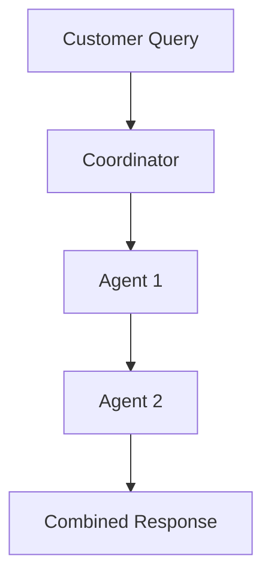
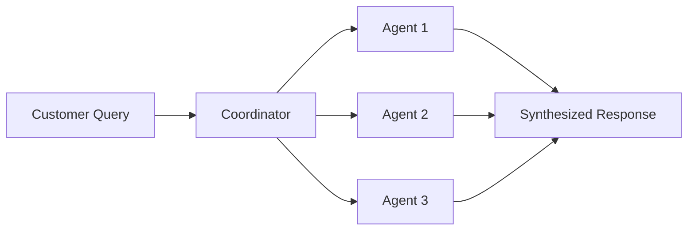

# Retail Agent Team - Modular Architecture

## 🏗️ Architecture Overview

### Modular Design Principles

1. **Separation of Concerns**: Each agent is in its own folder with dedicated responsibilities
2. **Single Responsibility**: Each agent focuses on one domain of retail operations
3. **Hierarchical Structure**: Root coordinator manages specialized sub-agents
4. **Scalability**: Easy to add new agents or modify existing ones
5. **Maintainability**: Changes to one agent don't affect others

### Agent Hierarchy

```
retail_coordinator (Root Agent)
├── product_search_agent
├── review_text_analysis_agent
├── inventory_agent
├── shopping_agent
└── customer_support_agent
```

## 🤖 Agent Modules

### 1. Root Coordinator (`retail-agents-team/agent.py`)

**Responsibility**: Orchestrates all sub-agents and manages complex workflows

**Key Functions**:
- Intelligent request routing to appropriate agents
- Multi-agent coordination for complex queries
- Context management across agent interactions
- Response synthesis from multiple agents

### 2. Product Search Agent (`product_search_agent/`)

**Responsibility**: Product discovery and information

**Key Functions**:
- Search products by various criteria
- Filter and compare products
- Provide detailed specifications
- Suggest alternatives

**Use Cases**:
- "Find wireless headphones under $100"
- "Compare iPhone 15 vs Samsung Galaxy S24"
- "Show me gaming laptops with RTX 4080"

### 3. Review Text Analysis Agent (`review_text_analysis_agent/`)

**Responsibility**: Customer review analysis and insights

**Key Functions**:
- Sentiment analysis
- Theme extraction
- Product strength/weakness identification
- Fake review detection

**Use Cases**:
- "What are customers saying about this product?"
- "Analyze recent reviews for product X"
- "Summarize pros and cons from reviews"

### 4. Inventory Agent (`inventory_agent/`)

**Responsibility**: Stock management and availability tracking

**Key Functions**:
- Real-time stock checks
- Multi-location inventory tracking
- Delivery time estimation
- Restock notifications

**Use Cases**:
- "Is the MacBook Pro in stock?"
- "Check availability across all warehouses"
- "When will this item be restocked?"

### 5. Shopping Agent (`shopping_agent/`)

**Responsibility**: Cart management and checkout processing

**Key Functions**:
- Cart operations (add/remove/update)
- Price calculation with taxes and discounts
- Coupon application
- Checkout processing

**Use Cases**:
- "Add 2 items to my cart"
- "Apply coupon SAVE20"
- "Calculate shipping to New York"

### 6. Customer Support Agent (`customer_support_agent/`)

**Responsibility**: Customer service and issue resolution

**Key Functions**:
- Order tracking and inquiries
- Returns and refunds processing
- Policy information
- Complaint resolution

**Use Cases**:
- "Track my order #12345"
- "I want to return my purchase"
- "What's your return policy?"

## 🔄 Agent Interaction Patterns

### Single-Agent Flow
```
Customer Query → Coordinator → Specialized Agent → Response
```

Example: "What's the return policy?" → customer_support_agent



Example: "Find laptops under $1000 that are in stock"
- product_search_agent (finds laptops)
- inventory_agent (checks stock)

### Multi-Agent Parallel Flow




Example: "I want to buy a highly-rated camera that's in stock"
- product_search_agent (finds cameras)
- review_text_analysis_agent (analyzes ratings)
- inventory_agent (checks availability)

## 🚀 Running the Agents

### Individual Agent Testing

Test a single agent:
```bash
adk run retail-agents-team/product_search_agent/
```

### Full System

Run the complete multi-agent system:
```bash
adk web 
```

### Development Mode

For local development:
```bash
adk run retail-agents-team/ --reload
```

## 📊 Benefits of Modular Architecture

1. **Maintainability**: 
   - Easy to update individual agents
   - Changes are isolated to specific modules
   - Clear code organization

2. **Scalability**:
   - Add new agents without affecting existing ones
   - Scale individual agents based on load
   - Parallel development by different teams

3. **Testability**:
   - Test each agent independently
   - Mock sub-agents for integration testing
   - Clear interfaces between components

4. **Reusability**:
   - Agents can be used in different contexts
   - Share common agent patterns
   - Extract and reuse agent logic

5. **Flexibility**:
   - Swap out agent implementations
   - A/B test different agent configurations
   - Mix and match agents for different use cases
