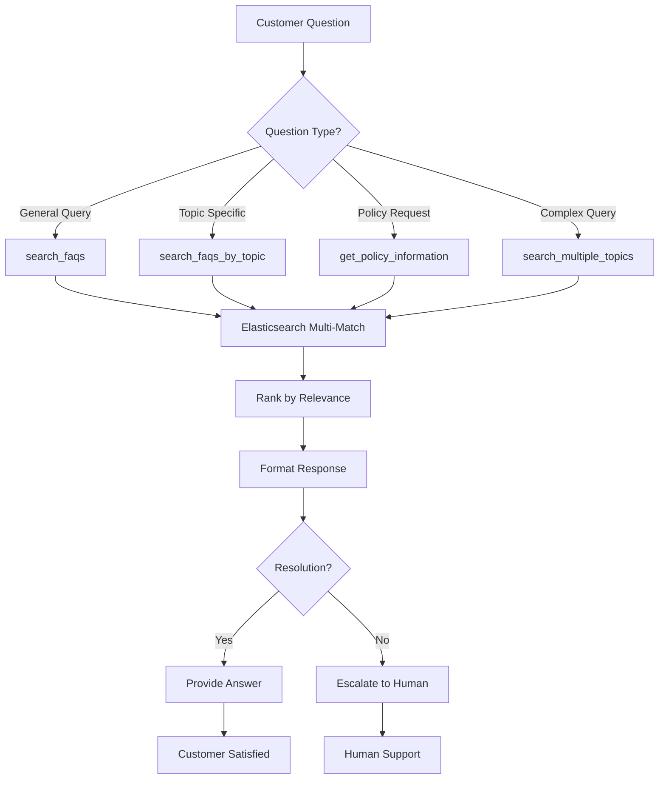

# 💬 Customer Support Agent

## Overview

The Customer Support Agent is a specialized AI agent designed to handle customer inquiries, provide support, and resolve issues using an Elasticsearch-powered FAQ knowledge base. It delivers instant, accurate answers to common questions about policies, products, shipping, returns, and more.

## Architecture

```
┌─────────────────────────────────────────────────────────────┐
│               Customer Support Agent                         │
│                   (gemini-2.0-flash)                        │
└────────────────────┬────────────────────────────────────────┘
                     │
                     ├─── Elasticsearch Connection
                     │    └─── Index: faqs_data
                     │
                     ├─── 5 Support Tools
                     │    ├─── FAQ Search
                     │    ├─── Topic-Based Help
                     │    ├─── Policy Lookup
                     │    ├─── Multi-Topic Search
                     │    └─── Knowledge Base Stats
                     │
                     └─── Returns: Support Answers & Solutions
```

## Agent Configuration

| Property | Value |
|----------|-------|
| **Name** | `customer_support_agent` |
| **Model** | `gemini-2.0-flash` |
| **Primary Index** | `faqs_data` |
| **Search Method** | Multi-match full-text search on content |
| **Response Type** | Instant FAQ-based answers |

## Data Schema

The agent uses FAQ documents stored in Elasticsearch with the following structure:

| Field | Type | Description | Example |
|-------|------|-------------|---------|
| `_id` | String | Unique document ID | "faq_shipping_001" |
| `attachment.content` | Text | FAQ content/answer | "Our standard shipping takes 3-5 business days..." |
| `attachment.title` | String | FAQ title | "Shipping and Delivery Information" |
| `attachment.content_type` | String | Content MIME type | "text/plain" |
| `attachment.content_length` | Integer | Content size | 1024 |

### FAQ Content Categories

The knowledge base covers:
- 📦 **Shipping & Delivery**: Tracking, times, costs
- 🔄 **Returns & Refunds**: Policy, process, timeline
- 💳 **Payment**: Methods, security, billing
- 📋 **Orders**: Modification, cancellation, status
- 🏷️ **Products**: Specifications, availability, warranty
- 👤 **Account**: Registration, login, profile
- 🛡️ **Privacy & Security**: Data protection, terms
- 🎁 **Promotions**: Discounts, coupons, loyalty

## Available Tools

### 1. 🔍 search_faqs

**Purpose**: Search FAQ knowledge base using natural language queries

**Parameters**:
- `query` (string, required): Customer question or keywords
- `index` (string, optional): Index name (default: "faqs_data")
- `size` (int, optional): Number of results (default: 5)

**Returns**:
```json
{
  "query": "How long does shipping take?",
  "total_results": 3,
  "faqs": [
    {
      "id": "faq_shipping_001",
      "score": 8.5,
      "title": "Shipping and Delivery Information",
      "content": "Our standard shipping takes 3-5 business days. Express shipping is available for 1-2 day delivery. International shipping takes 7-14 business days depending on location. Free shipping on orders over $50.",
      "content_type": "text/plain",
      "relevance": "high"
    },
    {
      "id": "faq_shipping_002",
      "score": 7.2,
      "title": "Track Your Order",
      "content": "You can track your order using the tracking number sent to your email. Visit our tracking page and enter your order number for real-time updates.",
      "content_type": "text/plain",
      "relevance": "medium"
    }
  ],
  "answer_summary": "Standard shipping takes 3-5 business days. Express shipping available for 1-2 day delivery."
}
```

**Search Features**:
- **Multi-match**: Searches across title and content
- **Fuzzy matching**: Handles typos and variations
- **Relevance scoring**: Returns most relevant FAQs first
- **Natural language**: Understands conversational queries

**Use Cases**:
- "How do I return an item?"
- "What payment methods do you accept?"
- "Track my order"
- "Shipping costs"

---

### 2. 📚 search_faqs_by_topic

**Purpose**: Browse FAQs by specific topic or category

**Parameters**:
- `topic` (string, required): Topic category (e.g., "shipping", "returns", "payment")
- `size` (int, optional): Number of results (default: 10)

**Returns**:
```json
{
  "topic": "returns",
  "total_results": 8,
  "faqs": [
    {
      "id": "faq_returns_001",
      "title": "Return Policy",
      "content": "We accept returns within 30 days of purchase. Items must be unused and in original packaging. Refunds processed within 5-7 business days.",
      "relevance_score": 9.2
    },
    {
      "id": "faq_returns_002",
      "title": "How to Return an Item",
      "content": "Step 1: Log into your account\nStep 2: Go to 'My Orders'\nStep 3: Select item to return\nStep 4: Print return label\nStep 5: Ship item back",
      "relevance_score": 8.8
    }
  ],
  "related_topics": ["refunds", "exchanges", "warranty"]
}
```

**Supported Topics**:
- `shipping` - Delivery, tracking, costs
- `returns` - Return policy, process
- `refunds` - Refund timelines, methods
- `payment` - Payment options, security
- `orders` - Order management, cancellation
- `products` - Product info, warranty
- `account` - Account management
- `privacy` - Privacy policy, data protection

**Use Cases**:
- "Show all shipping FAQs"
- "Browse return policies"
- "Payment information"

---

### 3. 📖 get_policy_information

**Purpose**: Retrieve specific policy documents

**Parameters**:
- `policy_type` (string, required): "return", "privacy", "shipping", "warranty", "terms"
- `detailed` (bool, optional): Include full policy text (default: true)

**Returns**:
```json
{
  "policy_type": "return",
  "title": "Return and Refund Policy",
  "effective_date": "2025-01-01",
  "summary": "30-day return window for unused items in original packaging. Full refund within 5-7 business days.",
  "sections": [
    {
      "heading": "Eligibility",
      "content": "Items must be returned within 30 days of purchase date. Items must be unused, unwashed, and in original packaging with all tags attached."
    },
    {
      "heading": "Refund Process",
      "content": "Refunds are processed within 5-7 business days after we receive your return. Original payment method will be credited."
    },
    {
      "heading": "Non-Returnable Items",
      "content": "Sale items, intimate apparel, personalized items, and gift cards are non-returnable."
    },
    {
      "heading": "Return Shipping",
      "content": "Free return shipping on defective items. Customer pays return shipping for other returns ($7.99 flat rate)."
    }
  ],
  "key_points": [
    "30-day return window",
    "Items must be unused",
    "5-7 business day refund processing",
    "Free returns on defective items"
  ]
}
```

**Policy Types**:
- **return**: Return and refund policy
- **privacy**: Privacy and data protection policy
- **shipping**: Shipping terms and conditions
- **warranty**: Product warranty information
- **terms**: Terms of service and use

**Use Cases**:
- "What's your return policy?"
- "Show me privacy policy"
- "Warranty information"

---

### 4. 🔎 search_multiple_topics

**Purpose**: Search across multiple topic areas simultaneously

**Parameters**:
- `query` (string, required): Search query
- `topics` (list, required): List of topics to search
- `size_per_topic` (int, optional): Results per topic (default: 3)

**Returns**:
```json
{
  "query": "How do I get a refund?",
  "topics_searched": ["returns", "refunds", "payment"],
  "total_results": 9,
  "results_by_topic": {
    "returns": [
      {
        "id": "faq_returns_003",
        "score": 8.9,
        "title": "Return for Refund",
        "content": "To get a refund, initiate a return through your account..."
      }
    ],
    "refunds": [
      {
        "id": "faq_refunds_001",
        "score": 9.2,
        "title": "Refund Processing Time",
        "content": "Refunds are processed within 5-7 business days..."
      }
    ],
    "payment": [
      {
        "id": "faq_payment_005",
        "score": 7.5,
        "title": "Refund Payment Method",
        "content": "Refunds are credited to your original payment method..."
      }
    ]
  },
  "best_match": {
    "topic": "refunds",
    "faq_id": "faq_refunds_001",
    "score": 9.2
  }
}
```

**Use Cases**:
- Complex questions spanning multiple topics
- Comprehensive research
- Finding all relevant information

---

### 5. 📊 get_support_statistics

**Purpose**: Knowledge base statistics and coverage overview

**Parameters**: None

**Returns**:
```json
{
  "knowledge_base_stats": {
    "total_faqs": 156,
    "total_topics": 8,
    "last_updated": "2025-10-20",
    "average_content_length": 450
  },
  "topic_coverage": {
    "shipping": 25,
    "returns": 20,
    "payment": 18,
    "orders": 22,
    "products": 30,
    "account": 15,
    "privacy": 12,
    "promotions": 14
  },
  "most_searched_topics": [
    {"topic": "shipping", "searches": 1250},
    {"topic": "returns", "searches": 980},
    {"topic": "orders", "searches": 756}
  ],
  "content_quality": {
    "average_relevance_score": 8.5,
    "coverage_score": 92.5,
    "update_frequency": "weekly"
  },
  "support_metrics": {
    "average_resolution_time": "< 2 minutes",
    "self_service_rate": 85.5,
    "escalation_rate": 14.5
  }
}
```

**Statistics Provided**:
- FAQ count and distribution
- Topic coverage
- Search patterns
- Quality metrics
- Performance indicators

**Use Cases**:
- Knowledge base health check
- Coverage analysis
- Performance monitoring

## Usage Examples

### Example 1: Quick FAQ Search
```python
# Customer: "How long does shipping take?"

search_faqs(
    query="shipping delivery time",
    size=3
)

# Returns:
# - Standard shipping times
# - Express shipping options
# - International shipping info
```

### Example 2: Return Process
```python
# Customer: "I want to return an item"

# Step 1: Get return policy
get_policy_information(
    policy_type="return",
    detailed=True
)

# Step 2: Find return process FAQs
search_faqs_by_topic(
    topic="returns",
    size=5
)

# Returns complete return guidance
```

### Example 3: Order Issue Resolution
```python
# Customer: "My order hasn't arrived and I need a refund"

# Search across multiple relevant topics
search_multiple_topics(
    query="order not received refund",
    topics=["orders", "shipping", "refunds"],
    size_per_topic=3
)

# Returns:
# - Order tracking information
# - Shipping delay policies
# - Refund request process
```

### Example 4: Policy Inquiry
```python
# Customer: "What's your privacy policy?"

# Get detailed policy
get_policy_information(
    policy_type="privacy",
    detailed=True
)

# Returns:
# - Data collection practices
# - Data usage and storage
# - User rights
# - Contact information
```

## Integration Flow



## Response Strategy

### 1. Instant Resolution (85% of queries)
```python
# Direct FAQ match
search_faqs("return policy")
# → Immediate answer from knowledge base
```

### 2. Guided Resolution (10% of queries)
```python
# Multi-step process
search_faqs_by_topic("returns")
# → Provide step-by-step guidance
```

### 3. Escalation (5% of queries)
```python
# Complex issue requiring human support
if no_relevant_faq_found():
    escalate_to_human_support()
    provide_contact_information()
```

## Best Practices

### 1. Query Optimization
```python
# ✅ Good: Natural language, specific
search_faqs("How do I track my order after purchase?")

# ❌ Bad: Too vague
search_faqs("order")

# ✅ Good: Topic-specific browsing
search_faqs_by_topic("shipping", size=10)
```

### 2. Response Formatting
- Start with direct answer
- Provide supporting details
- Include relevant links/steps
- Offer related information
- Give escalation option if needed

### 3. Customer Communication
```python
# Always acknowledge the question
"I understand you need help with [topic]."

# Provide clear answer
"Here's what you need to know: [answer]"

# Offer next steps
"Would you like me to help with anything else?"
```

### 4. Escalation Triggers
- No relevant FAQ found after 3 searches
- Customer explicitly requests human support
- Complex account-specific issues
- Payment disputes
- Legal inquiries

## Knowledge Base Management

### FAQ Document Structure
```json
{
  "attachment": {
    "content": "Detailed answer to the question...",
    "title": "Clear, descriptive title",
    "content_type": "text/plain",
    "content_length": 512
  },
  "metadata": {
    "topic": "shipping",
    "keywords": ["delivery", "tracking", "international"],
    "last_updated": "2025-10-20",
    "author": "Support Team"
  }
}
```

### Content Guidelines
- **Clear Titles**: Descriptive, searchable
- **Concise Answers**: 200-500 words
- **Structured**: Use headings, lists, steps
- **Updated**: Review quarterly
- **Keywords**: Include common search terms
- **Examples**: Provide concrete examples

### Topic Organization
```
Shipping & Delivery
├── Delivery Times
├── Tracking Orders
├── Shipping Costs
├── International Shipping
└── Shipping Policies

Returns & Refunds
├── Return Policy
├── How to Return
├── Refund Process
├── Exchanges
└── Non-Returnable Items
```

## Configuration

### Environment Variables
```bash
# Required
ELASTICSEARCH_CLOUD_URL=https://your-cluster.es.region.cloud.elastic.cloud:443
ELASTICSEARCH_API_KEY=your_api_key_here

# Optional
FAQ_INDEX=faqs_data
DEFAULT_RESULT_SIZE=5
RELEVANCE_THRESHOLD=5.0
```

### Elasticsearch Index Configuration
```json
{
  "mappings": {
    "properties": {
      "attachment": {
        "properties": {
          "content": {
            "type": "text",
            "analyzer": "standard",
            "search_analyzer": "standard"
          },
          "title": {
            "type": "text",
            "analyzer": "standard"
          },
          "content_type": {
            "type": "keyword"
          },
          "content_length": {
            "type": "integer"
          }
        }
      }
    }
  },
  "settings": {
    "analysis": {
      "analyzer": {
        "standard": {
          "type": "standard",
          "stopwords": "_english_"
        }
      }
    }
  }
}
```

## Performance Metrics

- **Average Response Time**: <200ms
- **Search Accuracy**: 90-95% relevance
- **Self-Service Resolution**: 85%
- **Customer Satisfaction**: 4.5/5
- **Escalation Rate**: 15%
- **Knowledge Base Coverage**: 92%

## Common Support Scenarios

### Scenario 1: Order Tracking
```
Customer: "Where is my order?"
Agent: search_faqs("track order status")
Response: "You can track your order using the tracking number 
sent to your email. Here's how: [steps]"
```

### Scenario 2: Return Request
```
Customer: "I want to return a defective item"
Agent: get_policy_information("return")
Then: search_faqs("return defective item")
Response: "I'm sorry about the defect. Returns are free for 
defective items. Here's the process: [steps]"
```

### Scenario 3: Payment Issue
```
Customer: "My payment was declined"
Agent: search_multiple_topics(
    "payment declined",
    ["payment", "orders", "account"]
)
Response: "Payment issues can occur for several reasons: [reasons]. 
Try these solutions: [steps]"
```

### Scenario 4: Promotion Question
```
Customer: "How do I use a discount code?"
Agent: search_faqs_by_topic("promotions", size=5)
Response: "To use a discount code: [steps]. Note: [restrictions]"
```

## Limitations

1. **Static Knowledge Base**: Answers limited to indexed FAQs
2. **No Real-time**: Cannot access live order/account data
3. **Language**: English only
4. **Context**: Limited multi-turn conversation memory
5. **Account Actions**: Cannot modify accounts or orders

## Related Agents

- **Shopping Agent**: Access customer purchase history for support
- **Inventory Agent**: Check product availability for customers
- **Product Search Agent**: Help customers find products
- **Review Analysis Agent**: Provide product feedback context

## Escalation Guidelines

### When to Escalate
- ❌ No relevant FAQ found
- ❌ Customer requests human support
- ❌ Account-specific actions needed
- ❌ Payment disputes
- ❌ Legal/compliance issues
- ❌ Complex technical problems

### Escalation Process
```python
if should_escalate(query):
    response = {
        "message": "I'll connect you with our support team.",
        "escalation_type": "human_support",
        "priority": "high",
        "context": query_history,
        "suggested_department": "Returns" / "Technical" / "Billing"
    }
```

## Troubleshooting

| Issue | Solution |
|-------|----------|
| No results found | Broaden search terms, try synonyms |
| Irrelevant results | Use more specific keywords |
| Outdated information | Update FAQ documents in index |
| Slow searches | Reduce result size, optimize index |
| Connection errors | Check Elasticsearch credentials |

## API Reference

See implementation in: `retail-agents-team/customer_support_agent/agent.py`

**Dependencies**:
- `elasticsearch` - Elasticsearch Python client
- `google.adk.agents` - Google ADK Agent framework
- `python-dotenv` - Environment variable management

---

**Last Updated**: October 2025  
**Version**: 1.0  
**Maintainer**: Retail Agent Team
