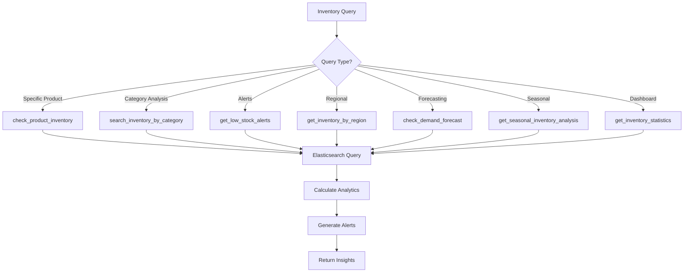

# 📦 Inventory Agent

## Overview

The Inventory Agent is a specialized AI agent for managing and tracking retail store inventory in real-time using Elasticsearch. It provides comprehensive inventory analytics, stock alerts, demand forecasting, and multi-location inventory management across different regions and stores.

## Architecture

```
┌─────────────────────────────────────────────────────────────┐
│                    Inventory Agent                           │
│                   (gemini-2.0-flash)                        │
└────────────────────┬────────────────────────────────────────┘
                     │
                     ├─── Elasticsearch Connection
                     │    └─── Index: retail_store_inventory
                     │
                     ├─── 7 Inventory Management Tools
                     │    ├─── Product Inventory Check
                     │    ├─── Category Search
                     │    ├─── Low Stock Alerts
                     │    ├─── Regional Inventory
                     │    ├─── Demand Forecasting
                     │    ├─── Seasonal Analysis
                     │    └─── Statistics Dashboard
                     │
                     └─── Returns: Real-time Inventory Intelligence
```

## Agent Configuration

| Property | Value |
|----------|-------|
| **Name** | `inventory_agent` |
| **Model** | `gemini-2.0-flash` |
| **Primary Index** | `retail_store_inventory` |
| **Capabilities** | Multi-location tracking, demand forecasting, alerts |
| **Update Frequency** | Real-time |

## Data Schema

The agent manages inventory data with the following fields:

| Field | Type | Description | Example |
|-------|------|-------------|---------|
| `Product ID` | String | Unique product identifier | "PROD_12345" |
| `Store ID` | String | Unique store identifier | "STORE_001" |
| `Category` | String | Product category | "Electronics", "Clothing", "Food" |
| `Region` | String | Geographic region | "North", "South", "East", "West" |
| `Inventory Level` | Integer | Current stock quantity | 150 |
| `Units Sold` | Integer | Total units sold | 450 |
| `Units Ordered` | Integer | Units on order | 200 |
| `Price` | Float | Product price | 299.99 |
| `Discount` | Float | Discount percentage | 15.0 |
| `Demand Forecast` | Integer | Predicted demand | 500 |
| `Competitor Pricing` | Float | Competitor prices | 319.99 |
| `Seasonality` | String | Seasonal category | "Summer", "Winter", "Spring", "Fall" |
| `Weather Condition` | String | Weather context | "Sunny", "Rainy", "Cold" |
| `Holiday/Promotion` | Boolean | Promotional flag | true/false |
| `Date` | Timestamp | Record timestamp | "2025-10-24T10:30:00Z" |

## Available Tools

### 1. 🔍 check_product_inventory

**Purpose**: Check real-time inventory levels for specific products across locations

**Parameters**:
- `product_id` (string, required): Product ID to check
- `store_id` (string, optional): Specific store filter
- `region` (string, optional): Region filter (North/South/East/West)
- `index` (string, optional): Index name (default: "retail_store_inventory")

**Returns**:
```json
{
  "product_id": "PROD_12345",
  "total_inventory": 450,
  "stock_status": "in_stock",
  "location_count": 5,
  "locations": [
    {
      "store_id": "STORE_001",
      "region": "North",
      "inventory_level": 150,
      "units_sold": 120,
      "units_ordered": 50,
      "price": 299.99,
      "discount": 10.0,
      "date": "2025-10-24",
      "category": "Electronics"
    }
  ],
  "summary": {
    "stores_in_stock": 5,
    "stores_low_stock": 1,
    "stores_out_of_stock": 0,
    "regions_available": ["North", "South", "East"]
  }
}
```

**Stock Status Classification**:
- `out_of_stock`: 0 units
- `critical`: 1-5 units
- `low_stock`: 6-9 units
- `moderate_stock`: 10-49 units
- `in_stock`: 50+ units

**Use Cases**:
- "Is Product XYZ in stock?"
- "Check inventory for store 001"
- "How many units in North region?"

---

### 2. 📂 search_inventory_by_category

**Purpose**: Search and analyze inventory by product category

**Parameters**:
- `category` (string, required): Product category (e.g., "Electronics", "Clothing")
- `region` (string, optional): Filter by region
- `min_inventory` (int, optional): Minimum stock threshold
- `max_inventory` (int, optional): Maximum stock threshold
- `size` (int, optional): Results to return (default: 50)

**Returns**:
```json
{
  "category": "Electronics",
  "total_products": 150,
  "total_inventory": 5420,
  "region_filter": "North",
  "inventory_range": {
    "min": 10,
    "max": 1000
  },
  "statistics": {
    "average_inventory": 36.13,
    "median_inventory": 25,
    "total_sold": 12450,
    "total_ordered": 3200
  },
  "products": [
    {
      "product_id": "PROD_12345",
      "store_id": "STORE_001",
      "inventory_level": 150,
      "units_sold": 120,
      "price": 299.99,
      "stock_status": "in_stock"
    }
  ],
  "stock_distribution": {
    "in_stock": 100,
    "moderate_stock": 35,
    "low_stock": 10,
    "out_of_stock": 5
  }
}
```

**Use Cases**:
- "Show all Electronics inventory"
- "Clothing items with low stock"
- "North region Food category inventory"

---

### 3. 🚨 get_low_stock_alerts

**Purpose**: Identify products below stock thresholds requiring restocking

**Parameters**:
- `threshold` (int, optional): Stock alert threshold (default: 10)
- `region` (string, optional): Filter by region
- `category` (string, optional): Filter by category
- `size` (int, optional): Results to return (default: 50)

**Returns**:
```json
{
  "threshold": 10,
  "total_alerts": 45,
  "alert_breakdown": {
    "critical": 15,
    "high": 18,
    "medium": 12
  },
  "alerts": [
    {
      "severity": "critical",
      "product_id": "PROD_99999",
      "store_id": "STORE_005",
      "region": "South",
      "category": "Food",
      "inventory_level": 2,
      "units_sold": 450,
      "demand_forecast": 500,
      "shortage_gap": 498,
      "recommended_order": 500,
      "urgency_score": 9.8
    }
  ],
  "regional_alerts": {
    "North": 12,
    "South": 18,
    "East": 10,
    "West": 5
  },
  "category_alerts": {
    "Electronics": 15,
    "Clothing": 12,
    "Food": 18
  }
}
```

**Alert Severity Levels**:
- **Critical**: 0-5 units (immediate action required)
- **High**: 6-9 units (restock soon)
- **Medium**: At threshold (monitor closely)

**Urgency Score Calculation**:
```python
urgency = (
    (demand_forecast - inventory_level) / demand_forecast * 5 +
    (units_sold / 100) * 3 +
    (1 if inventory_level == 0 else 0) * 2
)
```

**Use Cases**:
- "Show critical stock alerts"
- "Which products need restocking?"
- "Low stock in South region"

---

### 4. 🗺️ get_inventory_by_region

**Purpose**: Comprehensive regional inventory overview and analytics

**Parameters**:
- `region` (string, required): "North", "South", "East", or "West"
- `category` (string, optional): Filter by category
- `size` (int, optional): Sample size (default: 100)

**Returns**:
```json
{
  "region": "North",
  "total_stores": 25,
  "total_products": 1250,
  "total_inventory": 45000,
  "category_filter": "Electronics",
  "regional_statistics": {
    "total_value": 1250000.50,
    "average_inventory_per_store": 1800,
    "total_units_sold": 125000,
    "total_units_ordered": 35000,
    "average_price": 27.78
  },
  "category_breakdown": {
    "Electronics": {
      "products": 400,
      "inventory": 15000,
      "value": 450000.00,
      "percentage": 33.3
    },
    "Clothing": {
      "products": 500,
      "inventory": 20000,
      "value": 600000.00,
      "percentage": 44.4
    },
    "Food": {
      "products": 350,
      "inventory": 10000,
      "value": 200000.50,
      "percentage": 22.3
    }
  },
  "store_performance": [
    {
      "store_id": "STORE_001",
      "total_inventory": 2500,
      "categories": 3,
      "value": 75000.00,
      "stock_status": "healthy"
    }
  ],
  "alerts": {
    "low_stock_products": 15,
    "out_of_stock_products": 3
  }
}
```

**Use Cases**:
- "North region inventory overview"
- "Compare regional performance"
- "South region Electronics stock"

---

### 5. 📊 check_demand_forecast

**Purpose**: Compare current inventory against demand forecasts and identify gaps

**Parameters**:
- `product_id` (string, optional): Specific product to analyze
- `category` (string, optional): Category-wide analysis
- `region` (string, optional): Regional forecast analysis
- `size` (int, optional): Sample size (default: 50)

**Returns**:
```json
{
  "analysis_type": "category",
  "category": "Electronics",
  "total_products_analyzed": 150,
  "forecast_summary": {
    "total_current_inventory": 15000,
    "total_demand_forecast": 18500,
    "total_shortage": 3500,
    "coverage_percentage": 81.08,
    "products_with_shortage": 95,
    "products_well_stocked": 55
  },
  "products": [
    {
      "product_id": "PROD_12345",
      "store_id": "STORE_001",
      "region": "North",
      "category": "Electronics",
      "inventory_level": 150,
      "demand_forecast": 500,
      "shortage_gap": 350,
      "coverage_percent": 30.0,
      "recommendation": "Order 350 units immediately",
      "units_sold": 450,
      "units_ordered": 200,
      "status": "shortage"
    }
  ],
  "regional_forecast": {
    "North": { "shortage": 1200, "coverage": 75.5 },
    "South": { "shortage": 800, "coverage": 82.3 },
    "East": { "shortage": 1000, "coverage": 78.9 },
    "West": { "shortage": 500, "coverage": 88.1 }
  },
  "recommendations": [
    "Prioritize restocking PROD_12345 (350 unit shortage)",
    "North region needs 1200 additional units",
    "Consider increasing orders for high-demand products"
  ]
}
```

**Forecast Status Classification**:
- `well_stocked`: Inventory ≥ 120% of forecast
- `adequate`: Inventory 80-119% of forecast
- `shortage`: Inventory < 80% of forecast
- `critical`: Inventory < 50% of forecast

**Use Cases**:
- "Will we have enough stock for next month?"
- "Demand vs inventory analysis"
- "Which products need reordering?"

---

### 6. 🌤️ get_seasonal_inventory_analysis

**Purpose**: Analyze inventory preparedness for seasonal demand

**Parameters**:
- `seasonality` (string, required): "Summer", "Winter", "Spring", or "Fall"
- `region` (string, optional): Regional seasonal analysis
- `size` (int, optional): Sample size (default: 100)

**Returns**:
```json
{
  "season": "Summer",
  "region_filter": "North",
  "total_seasonal_products": 450,
  "seasonal_readiness": {
    "overall_score": 75.5,
    "inventory_coverage": 72.3,
    "demand_alignment": 78.7,
    "status": "moderate"
  },
  "inventory_vs_demand": {
    "total_inventory": 12500,
    "total_forecast": 17300,
    "shortage": 4800,
    "surplus": 0,
    "coverage_percentage": 72.25
  },
  "category_breakdown": {
    "Clothing": {
      "products": 250,
      "inventory": 8000,
      "forecast": 10000,
      "readiness_score": 80.0,
      "status": "ready"
    },
    "Accessories": {
      "products": 150,
      "inventory": 3500,
      "forecast": 5500,
      "readiness_score": 63.6,
      "status": "needs_attention"
    },
    "Footwear": {
      "products": 50,
      "inventory": 1000,
      "forecast": 1800,
      "readiness_score": 55.6,
      "status": "shortage"
    }
  },
  "regional_readiness": {
    "North": { "score": 75.5, "status": "moderate" },
    "South": { "score": 82.3, "status": "ready" },
    "East": { "score": 68.9, "status": "needs_attention" },
    "West": { "score": 88.1, "status": "ready" }
  },
  "recommendations": [
    "Increase Summer Clothing inventory by 2000 units",
    "Focus on Accessories category - 2000 unit shortage",
    "North region needs more Summer preparation"
  ]
}
```

**Readiness Score Calculation**:
```python
readiness_score = (current_inventory / demand_forecast) * 100

Status:
- ready: ≥ 85%
- moderate: 70-84%
- needs_attention: 50-69%
- critical: < 50%
```

**Use Cases**:
- "Are we ready for Summer season?"
- "Winter inventory preparation status"
- "Seasonal stock gaps"

---

### 7. 📈 get_inventory_statistics

**Purpose**: Comprehensive inventory dashboard with KPIs and overview

**Parameters**: None (returns global statistics)

**Returns**:
```json
{
  "last_updated": "2025-10-24T10:30:00Z",
  "global_statistics": {
    "total_products": 5000,
    "total_inventory": 175000,
    "total_stores": 100,
    "total_regions": 4,
    "total_categories": 15,
    "total_value": 5250000.00
  },
  "inventory_health": {
    "in_stock": 3500,
    "moderate_stock": 1000,
    "low_stock": 350,
    "out_of_stock": 150,
    "health_score": 85.5
  },
  "sales_metrics": {
    "total_units_sold": 425000,
    "total_units_ordered": 125000,
    "average_price": 30.00,
    "total_revenue": 12750000.00,
    "inventory_turnover": 2.43
  },
  "alerts_summary": {
    "critical_alerts": 45,
    "high_priority": 120,
    "medium_priority": 185,
    "low_priority": 250
  },
  "regional_performance": {
    "North": {
      "products": 1250,
      "inventory": 45000,
      "stores": 25,
      "health_score": 87.5
    },
    "South": {
      "products": 1200,
      "inventory": 42000,
      "stores": 24,
      "health_score": 82.3
    },
    "East": {
      "products": 1300,
      "inventory": 48000,
      "stores": 26,
      "health_score": 88.9
    },
    "West": {
      "products": 1250,
      "inventory": 40000,
      "stores": 25,
      "health_score": 91.2
    }
  },
  "category_performance": {
    "Electronics": { "inventory": 50000, "value": 1500000.00 },
    "Clothing": { "inventory": 70000, "value": 2100000.00 },
    "Food": { "inventory": 35000, "value": 1050000.00 }
  },
  "top_performers": {
    "most_stocked_category": "Clothing",
    "best_region": "West",
    "highest_turnover_category": "Food"
  }
}
```

**KPI Definitions**:
- **Health Score**: `(in_stock + moderate_stock) / total_products * 100`
- **Inventory Turnover**: `units_sold / average_inventory`
- **Value**: `Σ(inventory_level * price)`

**Use Cases**:
- "Overall inventory status"
- "Dashboard overview"
- "Executive summary"

## Usage Examples

### Example 1: Check Product Availability
```python
# Customer: "Is Product PROD_12345 in stock?"

# Step 1: Check inventory
check_product_inventory(
    product_id="PROD_12345",
    region="North"
)

# Step 2: If low, check demand forecast
check_demand_forecast(
    product_id="PROD_12345"
)
```

### Example 2: Restocking Analysis
```python
# Manager: "Which products need restocking urgently?"

# Step 1: Get low stock alerts
get_low_stock_alerts(
    threshold=10,
    region="South",
    size=50
)

# Step 2: Check demand forecasts for critical items
check_demand_forecast(
    category="Electronics",
    region="South"
)
```

### Example 3: Seasonal Preparation
```python
# Business: "Are we ready for Summer?"

# Step 1: Seasonal analysis
get_seasonal_inventory_analysis(
    seasonality="Summer",
    size=200
)

# Step 2: Check specific regions
get_inventory_by_region(
    region="North",
    category="Clothing"
)
```

### Example 4: Executive Dashboard
```python
# Executive: "Give me inventory overview"

# Get comprehensive statistics
get_inventory_statistics()

# Then drill down into alerts
get_low_stock_alerts(threshold=10, size=100)
```

## Integration Flow



## Best Practices

### 1. Proactive Monitoring
- Check `get_low_stock_alerts()` daily
- Monitor seasonal readiness 4-6 weeks in advance
- Review demand forecasts weekly
- Track inventory health score trends

### 2. Smart Restocking
```python
# Combine multiple tools for smart decisions
alerts = get_low_stock_alerts(threshold=10)
forecast = check_demand_forecast(category="Electronics")
seasonal = get_seasonal_inventory_analysis(seasonality="Summer")

# Prioritize: Critical alerts + High demand + Seasonal need
```

### 3. Regional Optimization
- Balance inventory across regions
- Consider regional demand patterns
- Optimize transfer between regions
- Monitor regional performance scores

### 4. Alert Management
- **Critical alerts**: Act within 24 hours
- **High priority**: Plan restocking within 3-5 days
- **Medium priority**: Monitor and schedule
- **Low priority**: Track trends

## Configuration

### Environment Variables
```bash
# Required
ELASTICSEARCH_CLOUD_URL=https://your-cluster.es.region.cloud.elastic.cloud:443
ELASTICSEARCH_API_KEY=your_api_key_here

# Optional
INVENTORY_INDEX=retail_store_inventory
LOW_STOCK_THRESHOLD=10
CRITICAL_STOCK_THRESHOLD=5
```

### Elasticsearch Index Mapping
```json
{
  "mappings": {
    "properties": {
      "Product ID": { "type": "keyword" },
      "Store ID": { "type": "keyword" },
      "Category": { "type": "keyword" },
      "Region": { "type": "keyword" },
      "Inventory Level": { "type": "integer" },
      "Units Sold": { "type": "integer" },
      "Units Ordered": { "type": "integer" },
      "Price": { "type": "float" },
      "Discount": { "type": "float" },
      "Demand Forecast": { "type": "integer" },
      "Seasonality": { "type": "keyword" },
      "Date": { "type": "date" }
    }
  }
}
```

## Performance Metrics

- **Query Response Time**: <200ms average
- **Real-time Updates**: Near real-time (< 1 second delay)
- **Alert Generation**: < 500ms
- **Dashboard Load**: < 1 second
- **Concurrent Users**: Supports 200+ simultaneous queries

## Limitations

1. **Historical Data**: Limited to current snapshot (not time-series)
2. **Predictive Accuracy**: Forecast depends on data quality
3. **Cross-store Transfers**: Not automatically calculated
4. **Price Updates**: Manual price synchronization required
5. **Multi-currency**: Single currency only

## Related Agents

- **Product Search Agent**: Find products → check inventory
- **Shopping Agent**: Add to cart → verify inventory
- **Customer Support Agent**: Customer inquiries → inventory status
- **Review Analysis Agent**: Popular products → ensure stock

## Troubleshooting

| Issue | Solution |
|-------|----------|
| Inaccurate stock counts | Verify real-time data sync with POS |
| Missing products | Check product_id format and indexing |
| Wrong regions | Validate region values (North/South/East/West) |
| Forecast misalignment | Review demand forecast algorithm |
| Slow queries | Add indices on Product ID, Store ID, Region |

## API Reference

See implementation in: 
- `retail-agents-team/inventory_agent/agent.py`
- `retail-agents-team/inventory_agent/tools.py`

**Dependencies**:
- `elasticsearch` - Elasticsearch Python client
- `google.adk.agents` - Google ADK Agent framework
- `python-dotenv` - Environment variable management

---

**Last Updated**: October 2025  
**Version**: 1.0  
**Maintainer**: Retail Agent Team
