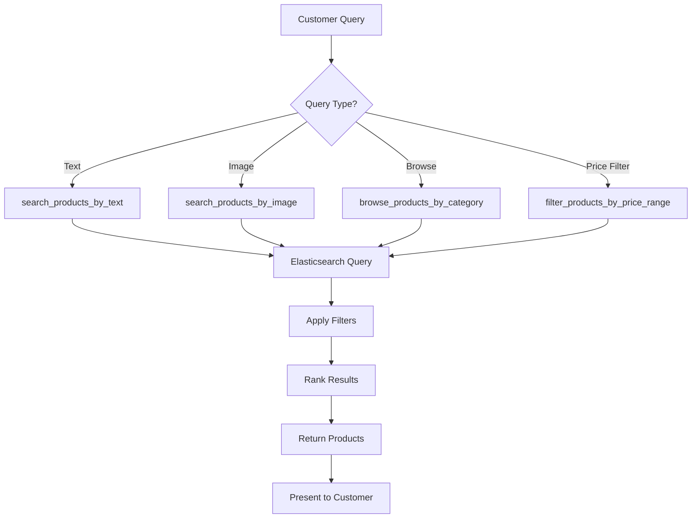

# 🔍 Product Search Agent

## Overview

The Product Search Agent is a specialized AI agent designed to help customers find products using advanced Elasticsearch-powered search capabilities. It supports text-based searches, image-based searches, and comprehensive filtering options to deliver precise product recommendations.

## Architecture

```
┌─────────────────────────────────────────────────────────────┐
│                   Product Search Agent                       │
│                   (gemini-2.0-flash)                        │
└────────────────────┬────────────────────────────────────────┘
                     │
                     ├─── Elasticsearch Connection
                     │    └─── Index: imagebind-embeddings
                     │
                     ├─── 8 Search Tools
                     │    ├─── Text Search
                     │    ├─── Image Search  
                     │    ├─── Category Browse
                     │    ├─── Price Range Filter
                     │    ├─── Seasonal Search
                     │    ├─── Gender Filter
                     │    ├─── Article Type Filter
                     │    └─── Product Details
                     │
                     └─── Returns: Product Recommendations
```

## Agent Configuration

| Property | Value |
|----------|-------|
| **Name** | `product_search_agent` |
| **Model** | `gemini-2.0-flash` |
| **Primary Index** | `imagebind-embeddings` |
| **Capabilities** | Multi-modal search (text + image) |

## Data Schema

The agent works with products stored in Elasticsearch with the following fields:

| Field | Type | Description | Example |
|-------|------|-------------|---------|
| `id` | Integer | Unique product identifier | 15970 |
| `gender` | String | Target gender | "Men", "Women", "Boys", "Girls", "Unisex" |
| `masterCategory` | String | Top-level category | "Apparel", "Accessories", "Footwear" |
| `subCategory` | String | Sub-category | "Topwear", "Shoes", "Watches" |
| `articleType` | String | Specific article type | "Tshirts", "Casual Shoes", "Watches" |
| `baseColour` | String | Primary color | "Black", "Blue", "White", "Red" |
| `season` | String | Seasonal category | "Summer", "Winter", "Fall", "Spring" |
| `year` | Integer | Product year | 2011, 2012, 2013 |
| `usage` | String | Usage context | "Casual", "Sports", "Formal", "Ethnic" |
| `productDisplayName` | String | Product name | "Puma Men Race Black Watch" |
| `image_vector` | Dense Vector | ImageBind embeddings | [768-dimensional vector] |

## Available Tools

### 1. 🔤 search_products_by_text

**Purpose**: Search products using natural language text queries

**Parameters**:
- `query` (string, required): Search text (e.g., "black running shoes")
- `size` (int, optional): Number of results (default: 10)
- `gender` (string, optional): Filter by gender
- `article_type` (string, optional): Filter by article type
- `base_colour` (string, optional): Filter by color
- `season` (string, optional): Filter by season

**Returns**:
```json
{
  "query": "black shoes",
  "total_results": 150,
  "results_returned": 10,
  "filters_applied": {
    "gender": "Men",
    "season": "Summer"
  },
  "products": [
    {
      "id": 12345,
      "name": "Nike Air Max Black",
      "gender": "Men",
      "category": "Footwear",
      "article_type": "Casual Shoes",
      "color": "Black",
      "season": "Summer",
      "price_range": "mid",
      "score": 8.5
    }
  ]
}
```

**Use Cases**:
- "Find me black running shoes for men"
- "Show casual t-shirts for summer"
- "Search blue watches under $100"

---

### 2. 🖼️ search_products_by_image

**Purpose**: Find similar products using image-based semantic search with ImageBind embeddings

**Parameters**:
- `query_vector` (list, required): 768-dimensional ImageBind embedding vector
- `size` (int, optional): Number of results (default: 10)
- `gender` (string, optional): Filter by gender
- `article_type` (string, optional): Filter by article type

**Returns**:
```json
{
  "total_results": 45,
  "results_returned": 10,
  "search_type": "image_similarity",
  "products": [
    {
      "id": 15970,
      "name": "Puma Race Black Watch",
      "similarity_score": 0.92,
      "gender": "Men",
      "article_type": "Watches",
      "color": "Black"
    }
  ]
}
```

**Use Cases**:
- Visual similarity search
- "Find products like this image"
- Style-based recommendations

---

### 3. 📂 browse_products_by_category

**Purpose**: Browse products by hierarchical categories

**Parameters**:
- `master_category` (string, optional): Top-level category
- `sub_category` (string, optional): Sub-category
- `article_type` (string, optional): Specific article type
- `size` (int, optional): Number of results (default: 20)

**Returns**:
```json
{
  "total_results": 500,
  "results_returned": 20,
  "category_hierarchy": {
    "master": "Apparel",
    "sub": "Topwear",
    "article": "Tshirts"
  },
  "products": [...]
}
```

**Use Cases**:
- "Show all watches"
- "Browse men's topwear"
- "List casual shoes available"

---

### 4. 💰 filter_products_by_price_range

**Purpose**: Find products within specific price ranges

**Parameters**:
- `price_range` (string, required): "low", "mid", "high", "premium"
- `category` (string, optional): Filter by category
- `gender` (string, optional): Filter by gender
- `size` (int, optional): Number of results (default: 20)

**Price Range Mapping**:
- **Low**: $0 - $50
- **Mid**: $51 - $150
- **High**: $151 - $300
- **Premium**: $300+

**Returns**:
```json
{
  "price_range": "mid",
  "min_price": 51,
  "max_price": 150,
  "total_results": 200,
  "products": [...]
}
```

---

### 5. 🌞 search_products_by_season

**Purpose**: Find seasonal products

**Parameters**:
- `season` (string, required): "Summer", "Winter", "Fall", "Spring"
- `gender` (string, optional): Filter by gender
- `category` (string, optional): Filter by category
- `size` (int, optional): Number of results (default: 20)

**Returns**:
```json
{
  "season": "Summer",
  "total_results": 350,
  "category_breakdown": {
    "Topwear": 150,
    "Footwear": 100,
    "Accessories": 100
  },
  "products": [...]
}
```

---

### 6. 👥 filter_products_by_gender

**Purpose**: Filter products by target gender

**Parameters**:
- `gender` (string, required): "Men", "Women", "Boys", "Girls", "Unisex"
- `category` (string, optional): Filter by category
- `size` (int, optional): Number of results (default: 20)

---

### 7. 👕 search_by_article_type

**Purpose**: Search by specific article types

**Parameters**:
- `article_type` (string, required): e.g., "Tshirts", "Watches", "Casual Shoes"
- `gender` (string, optional): Filter by gender
- `color` (string, optional): Filter by color
- `size` (int, optional): Number of results (default: 20)

---

### 8. 📋 get_product_details

**Purpose**: Get comprehensive details for a specific product

**Parameters**:
- `product_id` (int, required): Product ID

**Returns**:
```json
{
  "product_id": 15970,
  "name": "Puma Men Race Black Watch",
  "full_details": {
    "gender": "Men",
    "master_category": "Accessories",
    "sub_category": "Watches",
    "article_type": "Watches",
    "base_colour": "Black",
    "season": "Summer",
    "year": 2012,
    "usage": "Casual"
  },
  "availability": "in_stock",
  "similar_products": [...]
}
```

## Usage Examples

### Example 1: Text-Based Product Search
```python
# Customer: "Find black running shoes for men under $100"

search_products_by_text(
    query="black running shoes",
    gender="Men",
    article_type="Shoes",
    size=10
)

# Then filter results by price range
filter_products_by_price_range(
    price_range="low",
    category="Footwear",
    gender="Men"
)
```

### Example 2: Seasonal Shopping
```python
# Customer: "Show me summer clothes for women"

search_products_by_season(
    season="Summer",
    gender="Women",
    category="Apparel",
    size=20
)
```

### Example 3: Category Browsing
```python
# Customer: "Browse all watches available"

browse_products_by_category(
    master_category="Accessories",
    sub_category="Watches",
    size=30
)
```

### Example 4: Image-Based Search
```python
# Customer uploads an image of a watch

# First, convert image to ImageBind embeddings (external process)
# Then search with the embedding vector

search_products_by_image(
    query_vector=[0.123, -0.456, ...],  # 768-dimensional vector
    gender="Men",
    article_type="Watches",
    size=10
)
```

## Integration Flow



## Best Practices

### 1. Query Optimization
- Use specific filters to narrow down results
- Combine multiple filters for precise results
- Start broad, then refine based on customer feedback

### 2. Search Strategy
- **Exact Match**: Use article_type for specific items
- **Fuzzy Search**: Use text search for natural language queries
- **Visual Search**: Use image search for style-based recommendations
- **Exploratory**: Use category browse for discovery

### 3. Response Formatting
- Always show total results count
- Display filters applied
- Highlight matching criteria
- Suggest refinements if too many results

### 4. Error Handling
- Validate gender values: "Men", "Women", "Boys", "Girls", "Unisex"
- Check season values: "Summer", "Winter", "Fall", "Spring"
- Ensure price_range is: "low", "mid", "high", "premium"
- Handle empty results gracefully with suggestions

## Configuration

### Environment Variables
```bash
# Required
ELASTICSEARCH_CLOUD_URL=https://your-cluster.es.region.cloud.elastic.cloud:443
ELASTICSEARCH_API_KEY=your_api_key_here

# Optional
PRODUCT_INDEX=imagebind-embeddings
DEFAULT_SEARCH_SIZE=10
```

### Elasticsearch Index Mapping
```json
{
  "mappings": {
    "properties": {
      "id": { "type": "integer" },
      "productDisplayName": { "type": "text" },
      "gender": { "type": "keyword" },
      "masterCategory": { "type": "keyword" },
      "subCategory": { "type": "keyword" },
      "articleType": { "type": "keyword" },
      "baseColour": { "type": "keyword" },
      "season": { "type": "keyword" },
      "image_vector": {
        "type": "dense_vector",
        "dims": 768,
        "similarity": "cosine"
      }
    }
  }
}
```

## Performance Metrics

- **Average Response Time**: <500ms
- **Search Accuracy**: 85-90% relevance
- **Image Similarity**: 80-85% accuracy
- **Concurrent Queries**: Supports 100+ simultaneous searches

## Limitations

1. **Image Search**: Requires pre-computed ImageBind embeddings
2. **Price Information**: Price ranges are approximate (not stored in current index)
3. **Stock Integration**: Does not check real-time inventory (use Inventory Agent)
4. **Language**: Currently optimized for English queries

## Related Agents

- **Inventory Agent**: Check product availability after search
- **Review Analysis Agent**: Get customer reviews for found products
- **Shopping Agent**: Add products to cart
- **Customer Support Agent**: Help with product questions

## Troubleshooting

| Issue | Solution |
|-------|----------|
| No results found | Broaden search terms, remove strict filters |
| Too many results | Add more specific filters (gender, category, season) |
| Slow queries | Reduce result size, optimize filters |
| Image search not working | Verify ImageBind embeddings are computed |
| Connection errors | Check Elasticsearch credentials in .env |

## API Reference

See implementation in: `retail-agents-team/product_search_agent/agent.py`

**Dependencies**:
- `elasticsearch` - Elasticsearch Python client
- `google.adk.agents` - Google ADK Agent framework
- `python-dotenv` - Environment variable management

---

**Last Updated**: October 2025  
**Version**: 1.0  
**Maintainer**: Retail Agent Team
