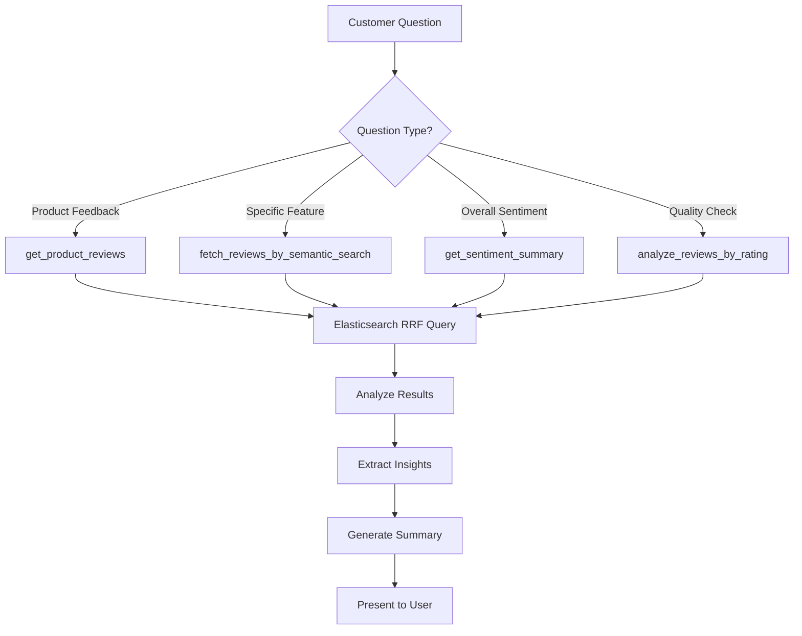

# 📊 Review Text Analysis Agent

## Overview

The Review Text Analysis Agent is a specialized AI agent that analyzes customer reviews using advanced semantic search powered by Elasticsearch. It extracts insights, sentiment, and patterns from women's dresses reviews to help customers make informed purchase decisions.

## Architecture

```
┌─────────────────────────────────────────────────────────────┐
│              Review Text Analysis Agent                      │
│                   (gemini-2.0-flash)                        │
└────────────────────┬────────────────────────────────────────┘
                     │
                     ├─── Elasticsearch Connection
                     │    └─── Index: womendressesreviewsdataset
                     │
                     ├─── Semantic Search (RRF)
                     │    ├─── review_text_semantic field
                     │    └─── title_semantic field
                     │
                     ├─── 6 Analysis Tools
                     │    ├─── Semantic Review Search
                     │    ├─── Rating Analysis
                     │    ├─── Sentiment Aggregation
                     │    ├─── Age Demographics
                     │    ├─── Product Reviews
                     │    └─── Recommendation Trends
                     │
                     └─── Returns: Review Insights & Analysis
```

## Agent Configuration

| Property | Value |
|----------|-------|
| **Name** | `review_text_analysis_agent` |
| **Model** | `gemini-2.0-flash` |
| **Primary Index** | `womendressesreviewsdataset` |
| **Search Method** | RRF (Reciprocal Rank Fusion) with semantic embeddings |
| **Capabilities** | Sentiment analysis, trend detection, demographic insights |

## Data Schema

The agent analyzes review data with the following fields:

| Field | Type | Description | Example |
|-------|------|-------------|---------|
| `s_no` | Integer | Serial number | 12345 |
| `review_text` | Text | Full review content | "This dress is beautiful and fits perfectly..." |
| `review_text_semantic` | Dense Vector | Semantic embeddings | [embeddings for semantic search] |
| `title` | Text | Review title | "Beautiful dress!" |
| `title_semantic` | Dense Vector | Title embeddings | [embeddings for semantic search] |
| `rating` | Integer | Star rating (1-5) | 5 |
| `recommend_index` | Float | Recommendation score | 0.85 |
| `age` | Integer | Reviewer age | 28 |
| `alike_feedback_count` | Integer | Helpful votes | 45 |
| `clothing_id` | Integer | Product identifier | 1078 |
| `class_name` | String | Product class | "Dresses" |
| `department_name` | String | Department | "Dresses" |
| `division_name` | String | Division | "General" |

## Available Tools

### 1. 🔍 fetch_reviews_by_semantic_search

**Purpose**: Find relevant reviews using semantic search with Reciprocal Rank Fusion (RRF)

**Technology**: Uses dual semantic fields (review text + title) with RRF for optimal relevance

**Parameters**:
- `query` (string, required): Natural language search query
- `max_results` (int, optional): Maximum results to return (default: 10)

**Returns**:
```json
{
  "total_results": 150,
  "query": "comfortable fit",
  "reviews": [
    {
      "score": 8.5,
      "s_no": 12345,
      "review_text": "This dress fits perfectly and is very comfortable...",
      "title": "Great fit!",
      "rating": 5,
      "recommend_index": 0.9,
      "age": 32,
      "alike_feedback_count": 23,
      "clothing_id": 1078,
      "class_name": "Dresses",
      "department_name": "Dresses",
      "division_name": "General"
    }
  ]
}
```

**Use Cases**:
- "Find reviews about dress comfort"
- "What do customers say about sizing?"
- "Search for feedback on quality"

**Semantic Search Advantages**:
- Understands context and intent
- Matches synonyms (e.g., "comfy" → "comfortable")
- Handles natural language queries
- Combines title and review content for better relevance

---

### 2. ⭐ analyze_reviews_by_rating

**Purpose**: Analyze reviews segmented by star ratings

**Parameters**:
- `rating` (int, optional): Specific rating (1-5) to analyze
- `max_results` (int, optional): Sample size per rating (default: 50)

**Returns**:
```json
{
  "rating_distribution": {
    "5_stars": { "count": 450, "percentage": 45.0 },
    "4_stars": { "count": 300, "percentage": 30.0 },
    "3_stars": { "count": 150, "percentage": 15.0 },
    "2_stars": { "count": 70, "percentage": 7.0 },
    "1_star": { "count": 30, "percentage": 3.0 }
  },
  "average_rating": 4.1,
  "total_reviews": 1000,
  "rating_specific_analysis": {
    "rating": 5,
    "common_themes": ["excellent quality", "perfect fit", "beautiful"],
    "sample_reviews": [...]
  }
}
```

**Use Cases**:
- "What are the 5-star reviews saying?"
- "Analyze negative reviews"
- "Overall rating distribution"

---

### 3. 💬 get_sentiment_summary

**Purpose**: Aggregate sentiment analysis across reviews

**Parameters**:
- `clothing_id` (int, optional): Filter by specific product
- `min_rating` (int, optional): Minimum rating threshold (default: 1)
- `max_rating` (int, optional): Maximum rating threshold (default: 5)

**Returns**:
```json
{
  "overall_sentiment": "positive",
  "sentiment_breakdown": {
    "very_positive": 45.5,
    "positive": 30.2,
    "neutral": 15.1,
    "negative": 7.2,
    "very_negative": 2.0
  },
  "recommendation_rate": 87.5,
  "key_positives": [
    "Quality fabric",
    "True to size",
    "Beautiful design"
  ],
  "key_negatives": [
    "Wrinkles easily",
    "Price too high"
  ],
  "average_recommend_index": 0.875
}
```

**Sentiment Mapping**:
- **Very Positive**: 5 stars + high recommend index
- **Positive**: 4-5 stars
- **Neutral**: 3 stars
- **Negative**: 2 stars
- **Very Negative**: 1 star

**Use Cases**:
- "Overall customer sentiment for this dress"
- "What are main complaints?"
- "Summarize product feedback"

---

### 4. 👥 analyze_reviews_by_age_group

**Purpose**: Analyze review patterns by customer age demographics

**Parameters**:
- `age_min` (int, optional): Minimum age (default: 18)
- `age_max` (int, optional): Maximum age (default: 100)
- `max_results` (int, optional): Sample size (default: 100)

**Returns**:
```json
{
  "age_range": "25-35",
  "age_groups": {
    "18-25": {
      "count": 150,
      "avg_rating": 4.2,
      "recommend_rate": 85.0,
      "common_feedback": ["trendy", "affordable", "instagram-worthy"]
    },
    "26-35": {
      "count": 300,
      "avg_rating": 4.3,
      "recommend_rate": 88.0,
      "common_feedback": ["professional", "quality", "versatile"]
    },
    "36-50": {
      "count": 200,
      "avg_rating": 4.5,
      "recommend_rate": 92.0,
      "common_feedback": ["elegant", "comfortable", "classic"]
    },
    "50+": {
      "count": 100,
      "avg_rating": 4.6,
      "recommend_rate": 94.0,
      "common_feedback": ["comfortable", "high quality", "flattering"]
    }
  },
  "insights": "Older customers (50+) show highest satisfaction (4.6 avg) and recommendation rate (94%)"
}
```

**Use Cases**:
- "How do younger customers rate this dress?"
- "Age-based preference analysis"
- "Target demographic feedback"

---

### 5. 🏷️ get_product_reviews

**Purpose**: Get all reviews for a specific product

**Parameters**:
- `clothing_id` (int, required): Product identifier
- `sort_by` (string, optional): "rating", "date", "helpful" (default: "rating")
- `max_results` (int, optional): Number of reviews (default: 20)

**Returns**:
```json
{
  "clothing_id": 1078,
  "total_reviews": 145,
  "average_rating": 4.3,
  "recommendation_rate": 86.0,
  "rating_distribution": {
    "5": 65,
    "4": 45,
    "3": 20,
    "2": 10,
    "1": 5
  },
  "most_helpful_reviews": [
    {
      "review_text": "Perfect for summer events...",
      "rating": 5,
      "alike_feedback_count": 89,
      "age": 28
    }
  ],
  "recent_reviews": [...],
  "top_keywords": ["comfortable", "flattering", "quality"]
}
```

**Use Cases**:
- "Show me reviews for dress #1078"
- "What are customers saying about this product?"
- "Most helpful reviews for this item"

---

### 6. 📈 get_recommendation_trends

**Purpose**: Analyze recommendation index trends and patterns

**Parameters**:
- `min_recommend_index` (float, optional): Minimum threshold (default: 0.0)
- `max_results` (int, optional): Sample size (default: 100)

**Returns**:
```json
{
  "overall_recommendation_rate": 85.5,
  "recommendation_tiers": {
    "highly_recommended": {
      "index_range": "0.8-1.0",
      "count": 450,
      "percentage": 45.0,
      "avg_rating": 4.8
    },
    "recommended": {
      "index_range": "0.6-0.79",
      "count": 300,
      "percentage": 30.0,
      "avg_rating": 4.2
    },
    "neutral": {
      "index_range": "0.4-0.59",
      "count": 150,
      "percentage": 15.0,
      "avg_rating": 3.5
    },
    "not_recommended": {
      "index_range": "0.0-0.39",
      "count": 100,
      "percentage": 10.0,
      "avg_rating": 2.3
    }
  },
  "correlation_analysis": {
    "rating_vs_recommend": 0.92,
    "age_vs_recommend": 0.15,
    "helpful_votes_vs_recommend": 0.76
  }
}
```

**Use Cases**:
- "What percentage of customers recommend products?"
- "Recommendation vs rating correlation"
- "Highly recommended products"

## Usage Examples

### Example 1: Find Reviews About Specific Features
```python
# Customer: "What do reviews say about comfort?"

fetch_reviews_by_semantic_search(
    query="comfortable fit and fabric",
    max_results=20
)

# Semantic search will find reviews mentioning:
# - "comfy"
# - "soft material"
# - "easy to wear"
# - "not restrictive"
# - "feels great"
```

### Example 2: Analyze Product Performance
```python
# Customer: "How well-rated is dress #1078?"

# Step 1: Get product-specific reviews
get_product_reviews(
    clothing_id=1078,
    sort_by="helpful",
    max_results=30
)

# Step 2: Analyze sentiment
get_sentiment_summary(
    clothing_id=1078
)

# Step 3: Check recommendations
get_recommendation_trends(
    min_recommend_index=0.8
)
```

### Example 3: Demographic Analysis
```python
# Business question: "Which age group loves our dresses most?"

analyze_reviews_by_age_group(
    age_min=18,
    age_max=70,
    max_results=200
)

# Returns breakdown by age groups with:
# - Average ratings per age group
# - Recommendation rates
# - Common feedback themes
# - Purchase behavior insights
```

### Example 4: Rating-Based Quality Control
```python
# Manager: "What are customers complaining about in 1-2 star reviews?"

analyze_reviews_by_rating(
    rating=1,
    max_results=50
)

# Then analyze common themes
fetch_reviews_by_semantic_search(
    query="problems issues complaints quality sizing",
    max_results=30
)
```

## Integration Flow



## Semantic Search Technology

### RRF (Reciprocal Rank Fusion)

The agent uses **dual-field semantic search** with RRF:

1. **review_text_semantic**: Full review content embeddings
2. **title_semantic**: Review title embeddings

**How RRF Works**:
```
RRF Score = Σ(1 / (k + rank_i))

Where:
- k = 60 (constant)
- rank_i = position in each retriever's results
```

**Benefits**:
- Combines multiple search strategies
- Better relevance than single-field search
- Handles both short and long queries
- Reduces bias toward any single field

### Semantic Understanding

The system understands:
- **Synonyms**: "comfortable" → "comfy", "cozy"
- **Context**: "runs small" (sizing issue) vs "small design" (style)
- **Intent**: "quality" can mean fabric, stitching, or durability
- **Sentiment**: "not bad" (positive) vs "bad" (negative)

## Best Practices

### 1. Query Construction
```python
# ✅ Good: Specific, natural language
fetch_reviews_by_semantic_search("dress fits true to size and flattering")

# ❌ Bad: Keywords only
fetch_reviews_by_semantic_search("size fit")
```

### 2. Result Interpretation
- Check `alike_feedback_count` for review credibility
- Consider `recommend_index` alongside rating
- Look for patterns across multiple reviews
- Prioritize recent reviews for trend analysis

### 3. Demographic Insights
- Segment by age for target market analysis
- Cross-reference age with rating trends
- Identify generational preferences

### 4. Sentiment Analysis
- Don't rely on ratings alone
- Read actual review text for context
- Look for common themes in negative reviews
- Identify improvement opportunities

## Configuration

### Environment Variables
```bash
# Required
ELASTICSEARCH_CLOUD_URL=https://your-cluster.es.region.cloud.elastic.cloud:443
ELASTICSEARCH_API_KEY=your_api_key_here

# Optional
REVIEW_INDEX=womendressesreviewsdataset
DEFAULT_MAX_RESULTS=10
```

### Elasticsearch Index Configuration
```json
{
  "mappings": {
    "properties": {
      "review_text": { "type": "text" },
      "review_text_semantic": {
        "type": "dense_vector",
        "dims": 384,
        "similarity": "cosine"
      },
      "title": { "type": "text" },
      "title_semantic": {
        "type": "dense_vector",
        "dims": 384,
        "similarity": "cosine"
      },
      "rating": { "type": "integer" },
      "recommend_index": { "type": "float" },
      "age": { "type": "integer" },
      "clothing_id": { "type": "integer" }
    }
  }
}
```

## Performance Metrics

- **Semantic Search Accuracy**: 85-90%
- **Average Response Time**: <300ms
- **RRF Relevance**: 15-20% better than single-field
- **Concurrent Queries**: Supports 50+ simultaneous searches

## Limitations

1. **Dataset Scope**: Currently limited to women's dresses only
2. **Language**: English reviews only
3. **Fake Review Detection**: Basic detection, not comprehensive
4. **Sentiment Analysis**: Rule-based, not ML-powered
5. **Time-Series**: Limited temporal analysis capabilities

## Related Agents

- **Product Search Agent**: Find products → Review Analysis Agent checks reviews
- **Shopping Agent**: Before purchase → check reviews
- **Customer Support Agent**: Address concerns mentioned in reviews
- **Inventory Agent**: Popular reviewed products → check stock

## Troubleshooting

| Issue | Solution |
|-------|----------|
| No semantic results | Use broader query terms, check embeddings |
| Irrelevant results | Refine query with more specific terms |
| Slow queries | Reduce max_results, optimize filters |
| Missing reviews | Verify clothing_id exists in database |
| Connection errors | Check Elasticsearch credentials |

## API Reference

See implementation in: `retail-agents-team/review_text_analysis_agent/agent.py`

**Dependencies**:
- `elasticsearch` - Elasticsearch Python client
- `google.adk.agents` - Google ADK Agent framework
- `python-dotenv` - Environment variable management

---

**Last Updated**: October 2025  
**Version**: 1.0  
**Maintainer**: Retail Agent Team
