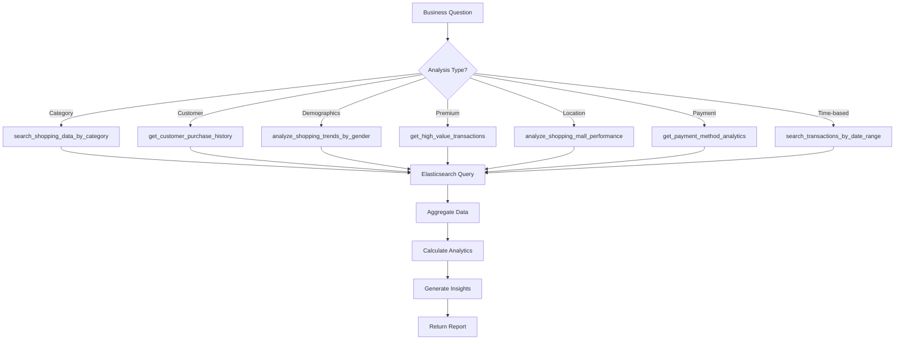

# 🛒 Shopping Agent

## Overview

The Shopping Agent is a specialized AI agent for analyzing customer shopping data, purchase patterns, and retail analytics using Elasticsearch. It provides deep insights into customer behavior, transaction trends, payment preferences, and mall performance to support business intelligence and decision-making.

## Architecture

```
┌─────────────────────────────────────────────────────────────┐
│                    Shopping Agent                            │
│                   (gemini-2.0-flash)                        │
└────────────────────┬────────────────────────────────────────┘
                     │
                     ├─── Elasticsearch Connection
                     │    └─── Index: customer_shopping_data.csv
                     │
                     ├─── 7 Analytics Tools
                     │    ├─── Category Analysis
                     │    ├─── Customer History
                     │    ├─── Gender Trends
                     │    ├─── High-Value Transactions
                     │    ├─── Mall Performance
                     │    ├─── Payment Analytics
                     │    └─── Date Range Search
                     │
                     └─── Returns: Shopping Insights & Analytics
```

## Agent Configuration

| Property | Value |
|----------|-------|
| **Name** | `shopping_agent` |
| **Model** | `gemini-2.0-flash` |
| **Primary Index** | `customer_shopping_data.csv` |
| **Capabilities** | Transaction analysis, customer profiling, trend detection |
| **Data Source** | Historical transaction database |

## Data Schema

The agent analyzes shopping transaction data with the following fields:

| Field | Type | Description | Example |
|-------|------|-------------|---------|
| `invoice_no` | String | Unique transaction ID | "INV_1234567" |
| `customer_id` | String | Unique customer ID | "CUST_98765" |
| `gender` | String | Customer gender | "Male", "Female" |
| `age` | Integer | Customer age | 28 |
| `category` | String | Product category | "Clothing", "Shoes", "Technology" |
| `quantity` | Integer | Items purchased | 2 |
| `price` | Float | Unit price (TL) | 450.50 |
| `payment_method` | String | Payment type | "Cash", "Credit Card", "Debit Card" |
| `invoice_date` | Date | Transaction date | "2023-05-15" |
| `shopping_mall` | String | Mall location | "Mall of Istanbul", "Kanyon" |

## Available Tools

### 1. 📊 search_shopping_data_by_category

**Purpose**: Analyze shopping transactions by product category

**Parameters**:
- `category` (string, required): Product category (e.g., "Clothing", "Shoes", "Technology")
- `size` (int, optional): Number of results (default: 20)

**Returns**:
```json
{
  "total_results": 450,
  "results_shown": 20,
  "category": "Clothing",
  "analytics": {
    "total_spending": 125450.50,
    "average_price": 278.78,
    "total_quantity": 856,
    "unique_malls": 5,
    "malls": ["Mall of Istanbul", "Kanyon", "Zorlu Center"],
    "payment_methods": {
      "Credit Card": 245,
      "Cash": 150,
      "Debit Card": 55
    },
    "gender_distribution": {
      "Female": 65.5,
      "Male": 34.5
    }
  },
  "transactions": [
    {
      "invoice_no": "INV_1234567",
      "customer_id": "CUST_98765",
      "gender": "Female",
      "age": 28,
      "category": "Clothing",
      "quantity": 2,
      "price": 450.50,
      "payment_method": "Credit Card",
      "invoice_date": "2023-05-15",
      "shopping_mall": "Mall of Istanbul"
    }
  ]
}
```

**Analytics Provided**:
- Total spending and average price
- Quantity sold
- Mall distribution
- Payment method preferences
- Gender distribution

**Use Cases**:
- "Show all Clothing purchases"
- "Analyze Technology category sales"
- "What's selling in Shoes category?"

---

### 2. 👤 get_customer_purchase_history

**Purpose**: Complete purchase history and profile for a specific customer

**Parameters**:
- `customer_id` (string, required): Customer ID to lookup
- `size` (int, optional): Maximum transactions (default: 50)

**Returns**:
```json
{
  "customer_id": "CUST_98765",
  "total_purchases": 24,
  "purchases_shown": 24,
  "customer_profile": {
    "gender": "Female",
    "age": 28
  },
  "spending_analytics": {
    "total_spent": 12450.75,
    "average_transaction": 518.78,
    "total_items_purchased": 45,
    "average_items_per_transaction": 1.88
  },
  "preferences": {
    "favorite_categories": [
      ["Clothing", 12],
      ["Shoes", 7],
      ["Accessories", 5]
    ],
    "favorite_malls": [
      ["Mall of Istanbul", 10],
      ["Kanyon", 8],
      ["Zorlu Center", 6]
    ],
    "payment_methods": [
      ["Credit Card", 15],
      ["Cash", 6],
      ["Debit Card", 3]
    ]
  },
  "purchase_history": [
    {
      "invoice_no": "INV_1234567",
      "date": "2023-05-15",
      "category": "Clothing",
      "quantity": 2,
      "price": 450.50,
      "total": 901.00,
      "payment_method": "Credit Card",
      "shopping_mall": "Mall of Istanbul"
    }
  ]
}
```

**Customer Insights**:
- Lifetime value (total spent)
- Shopping frequency patterns
- Category preferences
- Mall loyalty
- Payment preferences
- Average basket size

**Use Cases**:
- "What has customer CUST_98765 bought?"
- "Customer purchase profile"
- "Analyze this customer's behavior"

---

### 3. 👥 analyze_shopping_trends_by_gender

**Purpose**: Analyze shopping preferences and trends by gender

**Parameters**:
- `gender` (string, required): "Male" or "Female"
- `size` (int, optional): Sample size (default: 100)

**Returns**:
```json
{
  "gender": "Female",
  "total_transactions": 3450,
  "sample_size": 100,
  "spending_analytics": {
    "total_spent": 567890.50,
    "average_transaction": 164.63,
    "average_items": 1.75,
    "total_quantity": 6038
  },
  "category_preferences": {
    "Clothing": {
      "transactions": 1200,
      "percentage": 34.8,
      "avg_spend": 235.50,
      "total_spent": 282600.00
    },
    "Shoes": {
      "transactions": 850,
      "percentage": 24.6,
      "avg_spend": 189.75,
      "total_spent": 161287.50
    },
    "Accessories": {
      "transactions": 700,
      "percentage": 20.3,
      "avg_spend": 125.30,
      "total_spent": 87710.00
    }
  },
  "age_distribution": {
    "18-25": 25.5,
    "26-35": 38.2,
    "36-45": 22.1,
    "46+": 14.2
  },
  "payment_preferences": {
    "Credit Card": 55.8,
    "Cash": 28.5,
    "Debit Card": 15.7
  },
  "mall_preferences": {
    "Mall of Istanbul": 32.5,
    "Kanyon": 25.8,
    "Zorlu Center": 18.9
  },
  "insights": [
    "Female customers prefer Clothing category (34.8%)",
    "Average transaction: 164.63 TL",
    "Credit Card is most popular payment (55.8%)",
    "Age 26-35 is the largest segment (38.2%)"
  ]
}
```

**Gender Insights**:
- Category preferences by gender
- Spending patterns
- Age demographics
- Payment method preferences
- Mall preferences

**Use Cases**:
- "What do female customers buy?"
- "Male vs female shopping comparison"
- "Gender-based marketing insights"

---

### 4. 💎 get_high_value_transactions

**Purpose**: Identify premium transactions above specified amount

**Parameters**:
- `min_amount` (float, optional): Minimum transaction value (default: 100.0 TL)
- `size` (int, optional): Number of results (default: 20)

**Returns**:
```json
{
  "min_amount": 500.0,
  "total_high_value": 156,
  "results_shown": 20,
  "analytics": {
    "total_value": 89567.50,
    "average_transaction": 574.15,
    "highest_transaction": 2500.00,
    "average_items": 2.15
  },
  "category_breakdown": {
    "Technology": {
      "count": 65,
      "value": 42350.00,
      "percentage": 47.3
    },
    "Clothing": {
      "count": 45,
      "value": 28900.50,
      "percentage": 32.3
    },
    "Shoes": {
      "count": 46,
      "value": 18317.00,
      "percentage": 20.4
    }
  },
  "customer_demographics": {
    "gender_distribution": {
      "Female": 58.5,
      "Male": 41.5
    },
    "average_age": 34.5,
    "age_ranges": {
      "18-25": 15.2,
      "26-35": 42.8,
      "36-45": 28.5,
      "46+": 13.5
    }
  },
  "payment_analysis": {
    "Credit Card": 85.5,
    "Debit Card": 12.3,
    "Cash": 2.2
  },
  "transactions": [
    {
      "invoice_no": "INV_9876543",
      "customer_id": "CUST_12345",
      "transaction_amount": 2500.00,
      "category": "Technology",
      "quantity": 1,
      "gender": "Male",
      "age": 35,
      "payment_method": "Credit Card",
      "shopping_mall": "Zorlu Center",
      "date": "2023-06-20"
    }
  ]
}
```

**Premium Customer Insights**:
- High-value customer identification
- Luxury category preferences
- Premium payment method usage
- VIP customer demographics

**Use Cases**:
- "Show premium purchases"
- "Transactions over 500 TL"
- "Identify high-value customers"

---

### 5. 🏬 analyze_shopping_mall_performance

**Purpose**: Comprehensive mall performance analytics

**Parameters**:
- `shopping_mall` (string, optional): Specific mall (None for all malls)
- `size` (int, optional): Sample size (default: 50)

**Returns**:
```json
{
  "mall_name": "Mall of Istanbul",
  "total_transactions": 2450,
  "sample_size": 50,
  "performance_metrics": {
    "total_revenue": 456789.50,
    "average_transaction": 186.45,
    "total_customers": 1850,
    "average_items_per_transaction": 1.85,
    "total_items_sold": 4533
  },
  "category_performance": {
    "Clothing": {
      "transactions": 850,
      "revenue": 189567.00,
      "percentage": 41.5,
      "avg_price": 223.02
    },
    "Technology": {
      "transactions": 450,
      "revenue": 156890.00,
      "percentage": 34.3,
      "avg_price": 348.64
    },
    "Shoes": {
      "transactions": 600,
      "revenue": 78456.50,
      "percentage": 17.2,
      "avg_price": 130.76
    }
  },
  "customer_demographics": {
    "gender_split": {
      "Female": 62.5,
      "Male": 37.5
    },
    "average_age": 32.5,
    "age_distribution": {
      "18-25": 28.5,
      "26-35": 38.9,
      "36-45": 22.3,
      "46+": 10.3
    }
  },
  "payment_methods": {
    "Credit Card": 58.5,
    "Cash": 28.3,
    "Debit Card": 13.2
  },
  "peak_shopping_patterns": {
    "busiest_day": "Saturday",
    "average_weekend_revenue": 25678.50,
    "average_weekday_revenue": 18456.30
  },
  "mall_comparison": [
    {
      "mall": "Mall of Istanbul",
      "revenue": 456789.50,
      "transactions": 2450,
      "avg_transaction": 186.45,
      "rank": 1
    },
    {
      "mall": "Kanyon",
      "revenue": 389567.00,
      "transactions": 2100,
      "avg_transaction": 185.51,
      "rank": 2
    }
  ]
}
```

**Mall Performance KPIs**:
- Revenue and traffic
- Category mix
- Customer demographics
- Payment preferences
- Comparative ranking

**Use Cases**:
- "How is Mall of Istanbul performing?"
- "Compare all shopping malls"
- "Best performing mall"

---

### 6. 💳 get_payment_method_analytics

**Purpose**: Analyze payment method usage and preferences

**Parameters**:
- `size` (int, optional): Sample size (default: 100)

**Returns**:
```json
{
  "total_transactions": 5000,
  "sample_size": 100,
  "payment_distribution": {
    "Credit Card": {
      "count": 2850,
      "percentage": 57.0,
      "total_value": 567890.50,
      "avg_transaction": 199.26
    },
    "Cash": {
      "count": 1500,
      "percentage": 30.0,
      "total_value": 198456.00,
      "avg_transaction": 132.30
    },
    "Debit Card": {
      "count": 650,
      "percentage": 13.0,
      "total_value": 89567.50,
      "avg_transaction": 137.80
    }
  },
  "category_payment_preferences": {
    "Technology": {
      "Credit Card": 78.5,
      "Debit Card": 18.2,
      "Cash": 3.3
    },
    "Clothing": {
      "Credit Card": 55.8,
      "Cash": 32.5,
      "Debit Card": 11.7
    },
    "Food": {
      "Cash": 58.9,
      "Credit Card": 32.1,
      "Debit Card": 9.0
    }
  },
  "demographics_by_payment": {
    "Credit Card": {
      "avg_age": 35.5,
      "gender_split": {"Female": 58.5, "Male": 41.5},
      "age_distribution": {
        "18-25": 15.2,
        "26-35": 42.8,
        "36-45": 28.5,
        "46+": 13.5
      }
    },
    "Cash": {
      "avg_age": 28.5,
      "gender_split": {"Female": 52.3, "Male": 47.7}
    },
    "Debit Card": {
      "avg_age": 31.2,
      "gender_split": {"Female": 55.8, "Male": 44.2}
    }
  },
  "transaction_value_analysis": {
    "high_value_preferred_method": "Credit Card",
    "low_value_preferred_method": "Cash",
    "avg_credit_card_transaction": 199.26,
    "avg_cash_transaction": 132.30
  },
  "insights": [
    "Credit Card is dominant (57.0%) for higher-value purchases",
    "Cash preferred for Food category (58.9%)",
    "Technology buyers overwhelmingly use Credit Card (78.5%)",
    "Credit Card users have highest avg transaction (199.26 TL)"
  ]
}
```

**Payment Insights**:
- Payment method distribution
- Category-specific preferences
- Demographics by payment type
- Transaction value patterns

**Use Cases**:
- "Payment method preferences"
- "Cash vs card usage"
- "Credit card transaction analysis"

---

### 7. 📅 search_transactions_by_date_range

**Purpose**: Analyze transactions within specific date range

**Parameters**:
- `start_date` (string, required): Start date (YYYY-MM-DD or DD/MM/YYYY)
- `end_date` (string, required): End date (YYYY-MM-DD or DD/MM/YYYY)
- `size` (int, optional): Results per page (default: 50)

**Returns**:
```json
{
  "start_date": "2023-05-01",
  "end_date": "2023-05-31",
  "total_transactions": 1250,
  "results_shown": 50,
  "date_range_analytics": {
    "total_revenue": 234567.50,
    "average_daily_revenue": 7566.37,
    "total_items_sold": 2450,
    "average_transaction": 187.65,
    "unique_customers": 980
  },
  "daily_breakdown": [
    {
      "date": "2023-05-01",
      "transactions": 45,
      "revenue": 8456.50,
      "items_sold": 89
    },
    {
      "date": "2023-05-02",
      "transactions": 38,
      "revenue": 7123.00,
      "items_sold": 76
    }
  ],
  "category_performance": {
    "Clothing": {
      "transactions": 450,
      "revenue": 89567.00,
      "percentage": 38.2
    },
    "Technology": {
      "transactions": 320,
      "revenue": 78956.50,
      "percentage": 33.7
    },
    "Shoes": {
      "transactions": 280,
      "revenue": 45678.00,
      "percentage": 19.5
    }
  },
  "trends": {
    "peak_day": "2023-05-20",
    "peak_revenue": 12567.00,
    "lowest_day": "2023-05-03",
    "lowest_revenue": 3456.00,
    "weekend_vs_weekday": {
      "weekend_avg": 9876.50,
      "weekday_avg": 6789.30,
      "weekend_premium": 45.5
    }
  },
  "transactions": [...]
}
```

**Temporal Analytics**:
- Daily revenue trends
- Category performance over time
- Peak shopping days
- Weekend vs weekday patterns

**Use Cases**:
- "Sales in January"
- "Last month's transactions"
- "Weekly performance analysis"

## Usage Examples

### Example 1: Category Analysis
```python
# Business: "How is the Clothing category performing?"

# Step 1: Get category data
search_shopping_data_by_category(
    category="Clothing",
    size=50
)

# Step 2: Analyze by gender
analyze_shopping_trends_by_gender(
    gender="Female",
    size=100
)

# Result: Understand who buys clothing and their preferences
```

### Example 2: Customer Profiling
```python
# Support: "Tell me about customer CUST_98765"

# Get complete customer profile
get_customer_purchase_history(
    customer_id="CUST_98765",
    size=50
)

# Returns:
# - Lifetime value
# - Shopping preferences
# - Favorite categories
# - Payment methods
# - Mall preferences
```

### Example 3: Mall Performance
```python
# Manager: "Compare all shopping malls"

# Analyze all malls
analyze_shopping_mall_performance(
    shopping_mall=None,  # All malls
    size=100
)

# Then focus on top performer
analyze_shopping_mall_performance(
    shopping_mall="Mall of Istanbul",
    size=100
)
```

### Example 4: Premium Customer Identification
```python
# Marketing: "Find our VIP customers"

# Step 1: Get high-value transactions
get_high_value_transactions(
    min_amount=500.0,
    size=50
)

# Step 2: Analyze payment preferences
get_payment_method_analytics(size=100)

# Result: Profile of premium customers for targeted marketing
```

## Integration Flow



## Best Practices

### 1. Comprehensive Analysis
```python
# Combine multiple tools for complete picture
category_data = search_shopping_data_by_category("Clothing")
gender_trends = analyze_shopping_trends_by_gender("Female")
payment_data = get_payment_method_analytics()

# Cross-reference insights for better decisions
```

### 2. Customer Segmentation
- **High-value**: Transactions > 500 TL
- **Regular**: 3+ transactions
- **Occasional**: 1-2 transactions
- **Premium**: Top 10% spenders

### 3. Temporal Analysis
- Compare week-over-week
- Identify seasonal patterns
- Track growth trends
- Monitor daily fluctuations

### 4. Performance Metrics
- **Transaction Value**: Average basket size
- **Customer Retention**: Repeat purchase rate
- **Category Mix**: Revenue distribution
- **Payment Efficiency**: Payment method mix

## Configuration

### Environment Variables
```bash
# Required
ELASTICSEARCH_CLOUD_URL=https://your-cluster.es.region.cloud.elastic.cloud:443
ELASTICSEARCH_API_KEY=your_api_key_here

# Optional
SHOPPING_INDEX=customer_shopping_data.csv
DEFAULT_SAMPLE_SIZE=50
```

## Performance Metrics

- **Query Response Time**: <400ms average
- **Analytics Generation**: <800ms
- **Large Dataset Queries**: <2 seconds
- **Concurrent Analyses**: Supports 100+ simultaneous queries

## Limitations

1. **Historical Data Only**: No real-time transaction processing
2. **Limited Predictive**: Descriptive analytics, not prescriptive
3. **Single Currency**: Turkish Lira (TL) only
4. **Fixed Schema**: Cannot add custom fields without re-indexing
5. **Date Range**: Limited to available historical data

## Related Agents

- **Product Search Agent**: Find products → Shopping Agent analyzes purchase patterns
- **Inventory Agent**: Stock levels → Shopping Agent shows demand
- **Customer Support Agent**: Customer issues → Shopping Agent provides history
- **Review Analysis Agent**: Product feedback → Shopping Agent shows purchase trends

## Troubleshooting

| Issue | Solution |
|-------|----------|
| No transactions found | Check customer_id format, verify date range |
| Incomplete analytics | Increase sample size parameter |
| Slow queries | Reduce size, add date filters |
| Wrong category | Verify exact category name (case-sensitive) |
| Connection errors | Check Elasticsearch credentials |

## API Reference

See implementation in:
- `retail-agents-team/shopping_agent/agent.py`
- `retail-agents-team/shopping_agent/tools.py`

**Dependencies**:
- `elasticsearch` - Elasticsearch Python client
- `google.adk.agents` - Google ADK Agent framework
- `python-dotenv` - Environment variable management

---

**Last Updated**: October 2025  
**Version**: 1.0  
**Maintainer**: Retail Agent Team
